## 20.1 Kinesis Consumers
Kinesis data streams consumers get data records from data streams and process them. 
* AWS Lambda
* Kinesis Data Analytics
* Kinesis Data Firehose
* Custom Consumer: AWS SDK - Classic or Enhanced Fan-Out
* Kinesis Client Library (KCL): Library to simplify reading from data streams. 

Kinesis consumer data stream options:

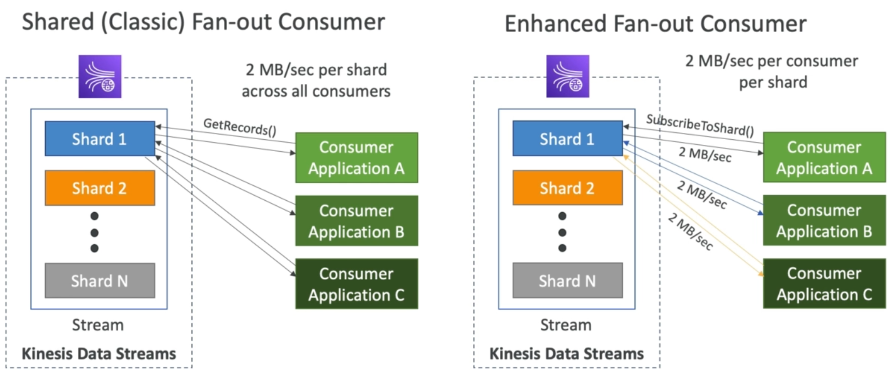

* In the shared(classic) fan-out consumer all consumers connected to a shard will get shared 2MB/sec data rate. As we can see from the image in the case of classic fan-out there are three shards connected to shard1 so each of three consumer will get data at the rate (2MB/sec.)/3 users = 682 KB/sec per consumer. In classic fan-out consumers use `GetRecords()`.
* While in the case of enhanced fan-out consumer all consumers connected a shard will get 2MB/sec data rate. As we can see from the image in the case of enhanced fan-out there are three shards connected to shard1 and all of them are getting data at the rate of 2MB/sec individually. In enhanced fan-out consumers use `SubscribeToShard()`.
* A comparison of classic fan-out and enhanced fan-out consumers is given below:
  
  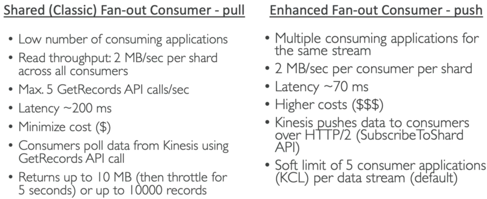

Kinesis Consumers - AWS Lambda
* Supports both classic and enhanced fan-out consumers.
* Read records in batches.
* We can configure `batch size` and `batch window`. 
* If error occur, Lambda retries until succeeds or data expired.
* Can process up to 10 batches per shard simultaneously.

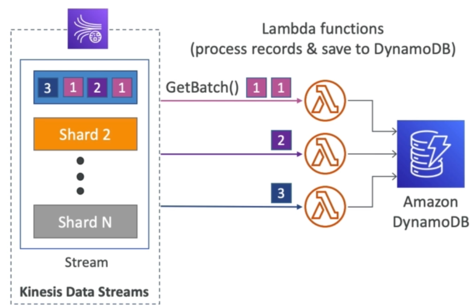

## 20.2 Kinesis Client Library (KCL): 
* A java library that simplifies reading data from kinesis data stream with distributed applications sharing the workload. 
* Each shard is to be read by only one KCL instance:
  - 4 shards = max. 4 KCL instances.
  - 6 shards = max. 6 KCL instances.
* Progress of the read is tracked in the KCL instance and checkpointed into DynamoDB (needs IAM access).
* Track other workers (other applications) and share the work amongst shards using DynamoDB.
* KCL can run on EC2, Elastic Beanstalk, or on-premises basically anything you want, but needs proper credentials and permissions.
* Records are read in order at the shard level.
* Their are two versions of KCL client library:
  - KCL 1.x: (supports shared consumer)
  - KCL 2.x: (supports shared and enhanced fan-out consumer)

#### KCL Example - 4 shards

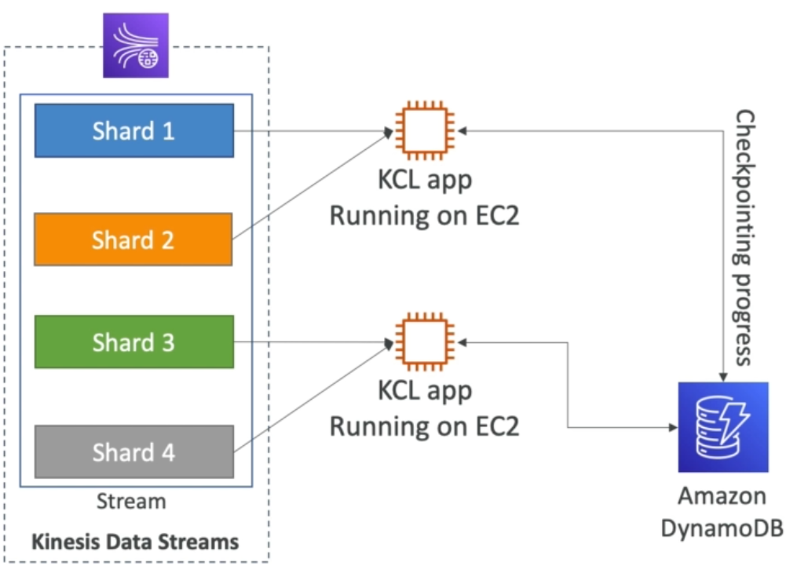

* We can run 2 KCL apps running on 2 EC2 instances. DynamoDB will keep track of the progress of the read (how far an app has read into Kinesis Data Stream) and manage the sharing of shards. As in this case the 1st KCL app is reading from shard 1 and 2, while the second KCL app is reading from shard 3 and 4.
* If one of the app goes down then the reading from the other shards will be resumed where it checkpointed.

#### KCL Example - 4 shards scaling KCL App

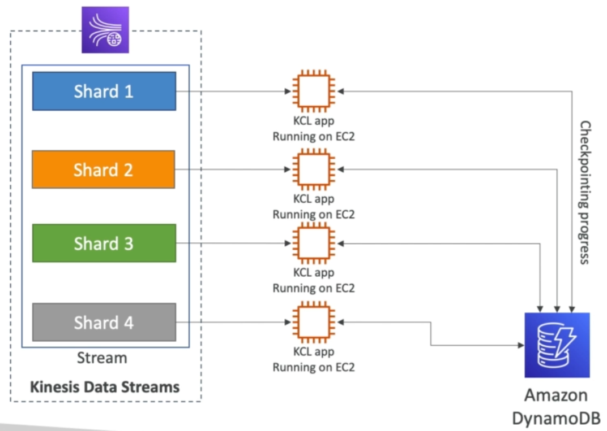

* If we scale up our KCL apps, and now we have 4 EC2 instances, then each instance would be reading from each shard. Therefore the progress will be resumed from DynamoDB and checkpointed again. We can't have KCL apps more than shards because then one will be doing nothing.
  
#### KCL Example - 6 shards scaling Kinesis

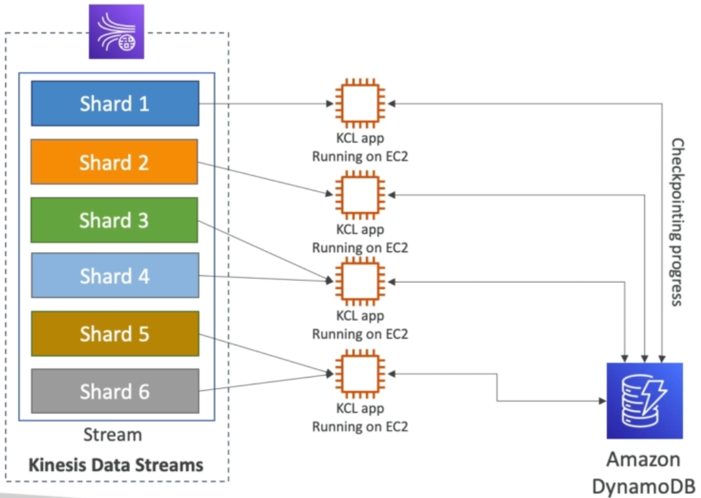

* If we scale up the Kinesis i.e. increase the number of shards, the change will be detected and with the help of DynamoDB they will again split the work between each KCL Application and the shard assignment. 
* If we have 6 shards that means we can scale up our KCL Application by increasing the number of apps to 6 and then each app will be reading from each shard. 
  

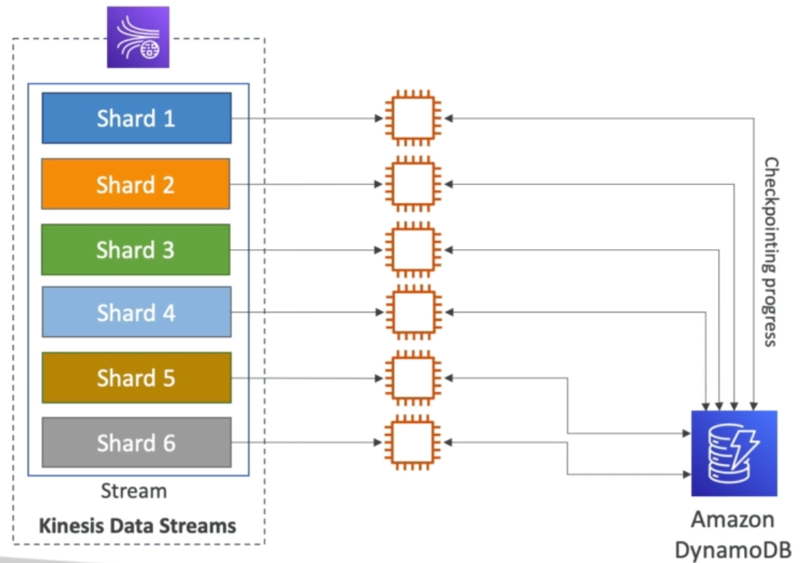

## 20.3 Kinesis Operations:

#### Kinesis Operations - Shard Splitting

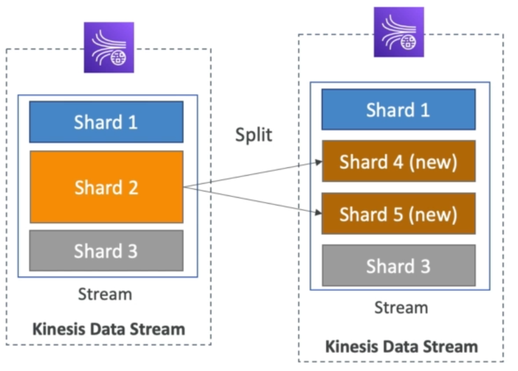

* Used to increase the stream capacity (1MB/sec data in per shard).
* Used to divide a hot shard.
* The old shard is closed (no more data write) and deleted once the data is expired (whatever the limit e.g. 365 days etc).
* No automatic scaling but there is a solution architecture to scale. We need to do it manually increase/decrease capacity.
* Can't split into more than two shards in single operation, if we want to split a shard into multiple shards then we need to do multiple splitting operations.

#### Kinesis Operations - Merging Shards

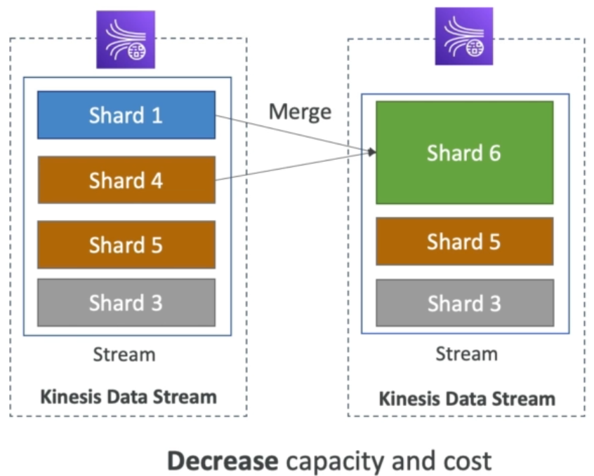

* Decrease the stream capacity and save costs.
* Can be used to group two shards with low traffic (cold shards), as in this example shard1 and shard4 are merged into shard6.
* Old shards will be deleted once the data is expired.
* Can't merge two shards in a single operation.

With shard splitting and merging we achieve the scaling of Kinesis.

## 20.4 Kinesis Data Firehose (KDF):
* Kinesis Data Firehose (KDF) can read data from all the different producers that we have seen for KDS and apart from that KDS can produce data to KDF, Amazon CloudWatch can produce data to KDF, AWS IoT can produce data to KDF.
* All these applications can be used to produce data to KDF at the rate of up to 1MB/sec.
* KDF can optionally choose to transform data using AWS Lambda.
* Then the data can be written into destination in batches, we don't need to write any kind of code because KDF knows how to write data.

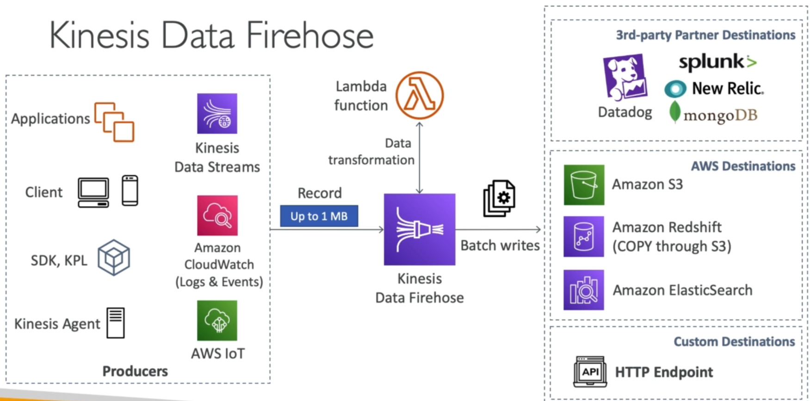

* There are three kinds of destinations for KDF.
* The number 1 destination is AWS destination. 
  - Amazon S3 destination.
  - Amazon Redshift destination (First data is written to S3 and then KDF will issue a COPY command and the data will be copied to Redshift from S3).
  - Amazon Elasticsearch destination. 
* There are also third party partner destinations such as:
  - Datadog
  - Splunk
  - New Relic
  - MongoDB
* If we have our own API with HTTP endpoint, we can send data to this custom destination.
* Once the data is sent to all these destinations we have two options:
  - We can send all the data to a S3 backup bucket. Or
  - We can send data that was failed to send these destinations to a S3 backup bucket.

#### KDF Attributes
* Fully managed service, no administration, automatic scaling and serverless.
* Pay for what you use i.e the data going through the Firehose.
* Near Real Time (NRT) `But not real time`:
  - 60 seconds latency for non full batches.
  - Or minimum 32MB of data at a time to send a data to the destination, which makes it near real time service and not the real time service.
* It supports many data formats, conversions, transformations and compression.
* Supports custom data transformations using AWS Lambda.
* Can send failed or all the data to backup S3 bucket.

#### When to use KDS and KDF
This is very important w.r.t exam point of view. The comparison is given below.

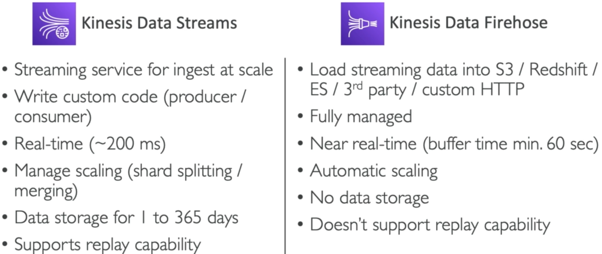

## 20.5 Kinesis Data Analytics (KDA):
#### KDA (SQL Applications)
* KDA takes data from different data sources usually streaming data sources e.g. KDS or KDF.
* We can run all sort of SQL queries on the data in KDA to do analytics on data in real time.
* Once the data is analyzed and then streaming as output, then stream can go to data sinks.

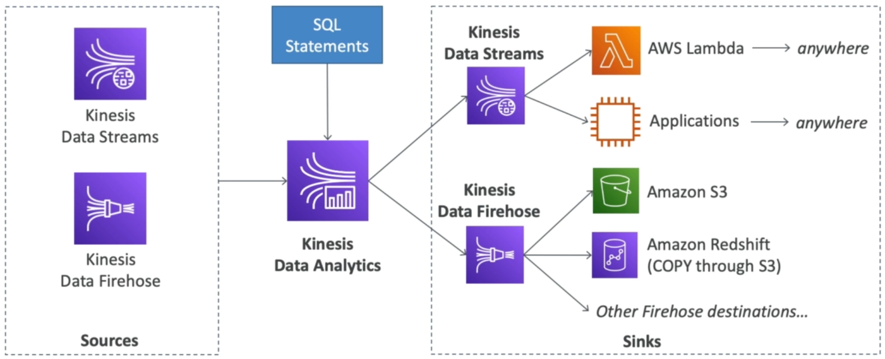

* The data can go to sinks like KDS or KDF:
  - If we send data to KDF then from there data can go to S3, Redshift or other firehose destinations.
  - If we send data to KDS then data can go to anywhere using AWS Lambda or to applications using KCL library.
* The whole purpose of KDA is to perform Stream Processing using SQL statements.

#### KDA Attributes
* Perform real-time analytics on Kinesis Streams using SQL.
* Fully managed to servers to provision.
* Automatic scaling and we'll pay for the data that goes through KDA.
* Real time analytics.
* Can create streams out of the real-time queries.
* Use case for KDA are:
  - Time-series analytics.
  - Real-time dashboards.
  - Real-time metrics.

## 20.6 SQS vs SNS vs Kinesis:
SQS vs SNS vs Kinesis

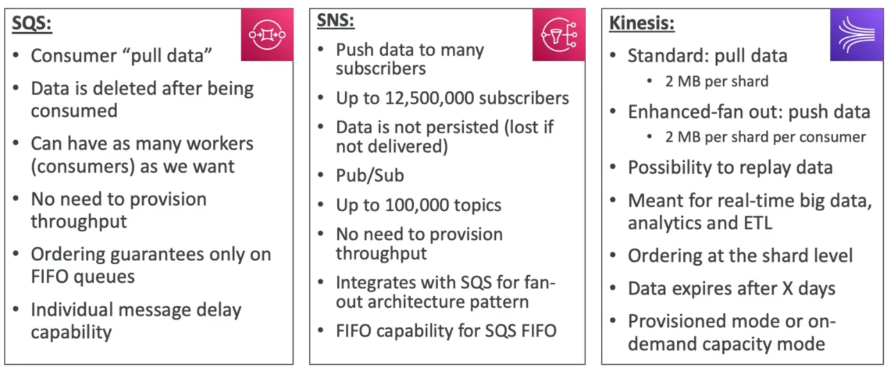

