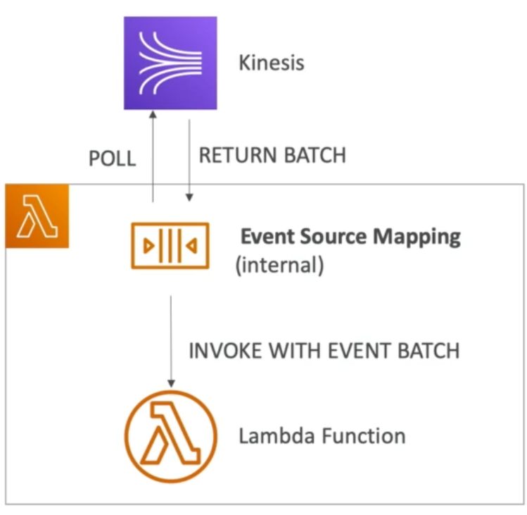
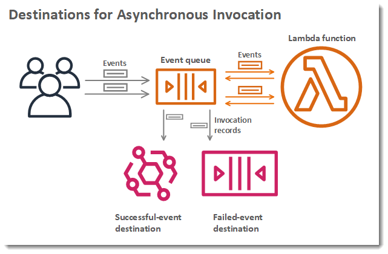

# 21. AWS Lambda

### 21.1 Serverless:
* Serverless is a new paradigm in which the developes don't have to manage servers.
* Serverless doesn't mean that there are no servers but it means that we developers don't have to manage or provision them.
* Serverless in AWS:
  - AWS Lambda
  - DynamoDB
  - AWS Cognito
  - AWS API Gateway
  - AWS S3
  - AWS SNS & SQS
  - AWS Kinesis Data Firehose
  - AWS Aurora
  - Step Functions
  - Fargate

### 21.2 AWS Lambda Overview:
#### Amazon EC2: 
- Virtual Servers in the Cloud.
- Limited by CPU and RAM.
- Continuously Running.
- Scaling means manual intervention.
#### AWS Lambda:
- Virtual Functions - No servers to manage
- Limited by time - short time execution (15 minutes).
- Run on demand.
- Scaling is automated.
- Pay per request and compute time.
- Free tier of 1,000,000 AWS Lambda requests and 400,000 GBs of compute time.
- Integrated with the whole of AWS suite of services.
- Integrated with many programming languages.
- Easy monitoring through AWS CloudWatch.
- Easy to get more resources per function (up to 10 GB of RAM).
- Increasing RAM will also improve CPU and network.

#### AWS Lambda Language Support:
- Node.js
- Python
- Java (Java 8 compatible)
- Golang
- Custom Runtime API
- Lambda Container Image
  * The container image must implement the Lambda Runtime API.
  * ECS/Fargate is preferred for running arbitrary docker images.

#### AWS Lambda Integrations (Main Ones):
- API Gateway
- Kinesis
- DynamoDB
- S3
- CloudFront
- CloudWatch Events - EventBridge
- CloudWatch logs
- SNS
- SQS
- Cognito
- And many others

#### Example: Serverless Thumbnail Creation:
- Whenever an image is uploaded to S3, it triggers the AWS Lambda function that creates the thumbnail.
- Then AWS Lambda creates the thumbnail and pushes to another S3.
- AWS Lambda also pushes some metadata to DynamoDB.
- As shown below:

<p align="center">

</p>

#### Example: Serverless CRON Job:
- Let's we set up an EventBridge Rule that would be triggered every one hour and would be integrated with AWS Lambda function that perform a task
- As shown below:

<p align="center">

</p>

#### AWS Lambda Pricing:
- Pay per calls:
  * First 1,000,000 requests are free.
  * $0.20 per 1 million requests thereafter ($0.0000002 per request).
- Pay per duration (in increment of 1ms):
  * 400,000 GBs of compute per month if free.
  * That means 400,000 seconds if RAM is 1GB.
  * And 3,200,000 seconds if RAM is 128MB.
  * After that $1 for 600,000 GBs.

### 21.3 Lambda - Synchronous Invocation:
- We are doing synchronous invocations when we are invoking lambda functions from CLI, SDL, API Gateway, Application Load Balancer.
  * Synchronous means we are waiting for results and then the results will be returned.
  * Error handling must happen on client side (retries, exponential backoff etc).
- Lambda - Synchronous Invocation Services:
  * User Invoked: 
    - Elastic Load Balancing (Application Load Balancer)
    - Amazon API Gateway
    - Amazon CloudFront(Lambda@Edge)
    - Amazon S3 Batch
  * Service Invoked:
    - Amazon Cognito
    - AWS Step Functions
  * Other Services: 
    - Amazon Lex
    - Amazon Alexa
    - Amazon Kinesis Data Firehose

- We can make synchronous invocation to our lambda function by using the following command:
```shell
aws lambda invoke --function-name demo-lambda --cli-binary-format raw-in-base64-out --payload '{"key1": "value-1", "key2": "value2", "key3":"value-3"}' response.json
```

### 21.4 Lambda and Application Load Balancer:
* If we want to use lambda function through the internet then we need to expose our lambda function as HTTP/HTTPS endpoint.
* There are two ways we can do this:
  - We can use the Application Load Balancer (ALB) to expose our lambda function as HTTP/HTTPS endpoint.
  - Or we can use API Gateway to expose our lambda function as HTTP/HTTPS endpoint.
* To make lambda function work it must be registered in a `target group`.

<p align="center">

</p>

* Client will be sending HTTP/HTTPS requests to our ALB, and our ALB will be invoking our lambda function synchronously in a target group.
* Synchronously because we are waiting for the lambda function to get back to the ALB, which will in turn send the response to the client.
* How does ALB converts an HTTP/HTTPS request to a lambda invocation?
* From ALB to lambda the HTTP/HTTPS is get transformed to a JSON payload.
* The query string parameters, the headers, and the body all of them are converted into key value pair.
* Lambda function will send a json payload to the ALB and ALB will convert it into HTTP/HTTPS response. The lambda function needs to include the status code, status description, headers, and body and flag of `isBase64Encoded` in the response.
* ALB can support multi-header values, and its an ALB setting.
* If we pass in multiple headers with same value or query string with the same values, then we can enable the multi-header setting.
* Then the HTTP headers and query string parameters that are sent with multiple values are shown as arrays within the AWS Lambda event and response object.

<p align="center">

</p>

### 21.5 Lambda@Edge:
* It is another type of synchronous invocation. 
* Let's say we have deployed a CDN using the CloudFront service.
* What if we wanted to run a lambda function globally alongside each edge location.
* Or how we can implement request filtering before reaching our application?
* For this we can use Lambda@Edge, we'll deploy Lambda functions alongside our CloudFront edge locations.
* Why we want to do this?
  - Build more responsive applications.
  - We don't need to manage servers, and Lambda is deployed globally.
  - Customize the CDN content.
  - Pay only what we use.

* We can use Lambda to change the CloudFront requests and responses.

<p align="center">

</p>

* There are four types of lambda functions at the edge.
* In the CloudFront we have four scenarios where we can use Lambda@Edge:
  - After CloudFront receives the request from a viewer (viewer request).
  - Before CloudFront forwards the request to the origin (origin request).
  - After CloudFront receives the response from the origin (origin response).
  - Before CloudFront forwards the response to the viewer (viewer response).
* We can also send a response to the viewers without ever sending a request to the origin, by using just viewer request and viewer response lambda function.

* ***Lambda@Edge Global Application:***
  - Let's say our website is statically hosted on S3 in the HTML form.
  - The user will visit this and will ask for some client side JS to do API request to CloudFront.
  - Then CloudFront will trigger our Lambda@Edge function, which is running globally alongside our edge locations. 
  - Then the lambda function maybe querying data from DynamoDB.

* ***Lambda@Edge Use Cases:***
  - WebSecurity and Privacy.
  - Dynamic Web Applications at the edge. 
  - Search Engine Optimization.
  - Intelligently Route Across Origins and Data Centres.
  - Bot Mitigation at teh Edge.
  - Real-Time image transformations.
  - A/B Testing.
  - User Authorization and Authentication.
  - User Prioritization.
  - Using Tracking and Analysis.


### 21.6 Lambda - Asynchronous Invocations:
* These are the services that will invoke our Lambda function behind the scenes e.g. S3, SNS, CloudWatch Events etc.

<p align="center">

</p>

* Let's say we have S3 bucket and a S3 event notification for new files and this will go into lambda service.
* Because this async and the event will be placed in an internal `Event Queue`.
* Our lambda function will be reading of from that `Event Queue`.
* Then lambda function will try to process these events but if somehow thing goes wrong i.e. an error occurs, lambda function will automatically retry.
* There will be three tries in total:
  - 1st retry will be immediately.
  - 2nd retry will be after 1 minute.
  - 3rd retry will be after 2 minutes.
* If the retries happen that means our lambda function will process the same event multiple times.
* We need to make sure that our lambda function is idempotent (idempotent means in case of retries the result is same).
* If the function is retries then we will see duplicate log entries in CloudWatch Logs and our Lambda function will retry over and over again.
* So to solve this problem we can define a Dead Letter Queue (DLQ) after the retries the Lambda function will send the event to the DLQ (i.e. SQS or SNS) for further processing later on.
* Asynchronous invocations allow us to speed the results if we don't need to wait for the result (e.g. 1000 files are processed at the same time). So we wait for all the 1000 files to be processed in parallel instead of each individual result.
* ***Lambda - Asynchronous Invocation - Services:***
  - S3.
  - SNS.
  - CloudWatch Events/EventBridge.
  - AWS CodeCommit (CodeCommitTrigger: new branch, new commit, new push).
  - AWS CodePipeline (invoke Lambda function during the pipeline, Lambda must callback).
  - Amazon CloudWatch Logs (log processing)
  - Amazon Simple Email Service
  - AWS CloudFormation
  - AWS Config
  - AWS IoT
  - AWS IoT Events

### 21.7 Lambda and CloudWatch Events/EventBridge:
* There are two ways to invoke Lambda functions from EventBridge:
* The first is to do a serverless cron job or a rate and for that we are going to create and EventBridge rule.
* Let's say it will trigger our lambda function every 1 hour to perform our task.

<p align="center">


* The second way is that we can create Rule with an event pattern e.g. we can create CodePipeline EventBridge rule.
* Every time CodePipeline state changes, and on state changes it will invoke the lambda function to perform the task.


### 21.8 Lambda and S3 Event Notifications:
* Integrating S3 Events with AWS Lambda.
* There is an event notification whenever:
  - S3:ObjectCreated
  - S3:ObjectRemoved
  - S3:ObjectRestore
  - S3:ObjectReplicated
  - and others
* Object name filtering is possible either by prefix or by suffix (*.jpg).
* The use case can be generate thumbnails of images uploaded to S3.

<p align="center">

</p>

* So we have our events into S3 and S3 can send those events to three things:
  - SNS and from SNS we can send those to multiple SQS using fan-out pattern.
  - Or we can send them to an SQS Queue and have lambda function read directly from the SQS Queue.
  - Or we can have S3 event notification directly invoke our lambda function and this would be asynchronous invocation, and in case of errors we can setup a dead letter queue.

* These S3 event notifications are normally delivered in seconds but sometimes can take a minute or longer. 
* If we want to make sure that we don't miss any event notification then we need to enable versioning for our bucket, because if two writes are made at the same time, it is possible that only a single event notification will be sent.
* We have a simple use case of S3 Event Pattern for MetaData Sync.

<p align="center">

</p>

* An S3 bucket will have a new file event to lambda function and then the lambda function will process the file and put the metadata into DynamoDB Table or even a Table in RDS Database.


### 21.9 Lambda Event Source Mapping:
* Lambda Event Source Mapping is the last category of how Lambda can process events in AWS other were Lambda Synchronous and Asynchronous Invocations.
* Lambda Event Source Mapping is a way to map an event source to a Lambda function.
* Lambda Event Source Mapping applies to 
  - Kinesis Data Streams
  - SQS and SQS FIFO Queue
  - DynamoDB Streams
* The common denominator for all event sources is that Lambda need to be pooled from the source.
* In this case Lambda Function is invoked synchronously.
* If we configure lambda to read from Kinesis, then an Event Source Mapping will be created internally which will be responsible for polling the data from Kinesis and getting the results back in the form of Batch.
* When Event Source Mapping will have some data it will invoke the Lambda Function synchronously with an event batch, as shown below.

<p align="center">

</p>

* There are two categories of event source mapper:
  - Streams 
  - Queues
  
* `Lambda Event Source Mapping Streams` apply to Kinesis Data Streams and DynamoDB Streams.
* In case of streams Event Source Mapping create an iterator for each `shard` (Kinesis shard or DynamoDb shard), and process items in order at shard level.
* The reads can be performed from start with new items, or from the beginning or from a specific timestamp. 
* Processed items aren't removed from the stream (so other consumers can read them).
* For `Low traffic`: use batch window to accumulate records before processing to invoke Lambda Function efficiently.
* For `High traffic`: setup lambda to process multiple batches in [parallel](https://aws.amazon.com/blogs/compute/new-aws-lambda-scaling-controls-for-kinesis-and-dynamodb-event-sources/) at shard level, as shown below.

<p align="center">

</p>

  - Up to 10 batches per shard.
  - in-order processing is still guaranteed for each partition key but not at the shard level instead each key within the shard will be processed in-order.

* By default, if function returns an error the entire batch is reprocessed until the function succeeds, or the items in the batch expire.
* To ensure the in-order processing, processing for the affected shard is paused until the error is resolved,
* We can configure the event source mapping to:
  - discard old events.
  - restrict the number of retries.
  - split the batch on error (to work around Lambda timeout issues).
* Discarded events can go to a Destination.


* `Lambda Event Source Mapping Queues` apply to SQS and SQS FIFO Queue.
* The workflow is somewhat similar to the Streams case, the Lambda Event Source Mapping will poll the SQS/SQS FIFO Queue and whenever a Batch of data is returned our lambda function will be invoked synchronously.
* Event Source Mapping will poll SQS using `Long Polling` which is efficient.
* Specify batch size of 1-10 messages.
* AWS recommends to set the queue visibility timeout to 6x the timeout of our Lambda function.
* To use DLQ, the DLQ should be set-up on the SQS Queue not Lambda Function because DLQ for Lambda is only for async invocations and these are synchronous invocations.

* Lambda also supports in-order processing for FIFO queues scaling up to the number of active message groups.
* For standard queues, items aren't necessarily processed in order.
* For standard queues, the Lambda scales up to process the queue messages as quickly as possible.
* When an error occurs, batches are returned to the queue as individual items and might be processed in a different grouping than the original batch.
* Occasionally, the event source mapping might receive the same item from the queue twice, even if no function error occurred, so the Lambda function should be idempotent.
* Lambda deletes items from the queue after processing.
* We can configure the source queue to send items to a DLQ if they can't be processed.

* ***Lambda Event Mapper Scaling:***
  - `Streams` get 1 Lambda invocation per stream shard.
  - Or if we use parallelization, we can have up to 10 batches processed per shard simultaneously.
  - For `SQS Standard` Lambda adds 60 more instances per minute to scale up.
  - Up to 1000 batches of messages can be processed simultaneously.
  - For `SQS FIFO` messages with the same GroupID are processed in order.   
  - The Lambda function scales to the number of active message groups.

### 21.10. AWS Lambda - Destinations:
* In case of [asynchronous](https://docs.aws.amazon.com/lambda/latest/dg/invocation-async.html) and event source mapping it was very hard to tell wether the processing is successful or failed and it was difficult to retrieve data as well.
* We can configure a Destination in AWS Lambda to send the result of asynchronous invocation or failure of Event Source Mapping to somewhere so we can check.
* For async invocations we can define destinations for successful and failed event. For async invocations we have following destinations:
  - Amazon SQS
  - Amazon SNS
  - AWS Lambda
  - Amazon EventBridge bus
* In case of async we can have two destinations one for success and one for failure.
* The idea is when we invoke Lambda Function if the processing is succeeds we'll send it to successful event destinations if it fails then to a failed event destination.
* AWS recommends to use destinations instead of DLQ (but both can be used at the same time) because destinations are newer and they allow for more targets, while DLQ only allows to send to SQS and SNS.

<p align="center">

</ps> 

* Destinations are used with `Event Source Mapping` only used when an event batch get discarded, because we can't process it and then we can send to following failed event destinations:
  - Amazon SQS
  - Amazon SNS
* We can either set a failed destination in Lambda or we can setup a DLQ directly on SQS Queue. 

<p align="center">

</p>

### 21.11. Lambda Execution Role:
* ***Execution Roles:*** Grants the Lambda function permissions to AWS services/resources.
* Sample managed policies for Lambda:
  - AWSLambdaBasicExecutionRole - grants basic permissions to write logs to CloudWatch Logs.
  - AWSLambdaKinesisExecutionRole - Read from Kinesis
  - AWSLambdaDynamoDBExecutionRole - Read from DynamoDB Streams
  - AWSLambdaSQSQueueExecutionRole - Read from SQS
  - AWSLambdaVPCAccessExecutionRole - Deploy Lambda function in VPC
  - AWSXRayDaemonWriteAccess - Upload traces data to X-Ray
* When we use an `Event Source Mapping` to invoke our function, Lambda uses execution role to read event data. 
* In case of `Event Source Mapping` the Lambda is used to read the event data, in case of other services Lambda function was invoked in other ways, that's why we don't need Execution Role in case of other services.
* Best practice is to create one Lambda Execution Role per Lambda Function.

* ***Resource Based Policies:***
* Use resource based policies to grant permissions to other AWS services/resources.
* Similar to S3 bucket policies for S3 buckets.
* An IAM principal can access Lambda:
  - If the IAM policy attached to the principal authorizes it (e.g. user access)
  - Or if the resource-based policy authorizes (eg, service access)
* When an AWS service like Amazon S3 calls our Lambda function, the resource-based policy gives it access.


### 21.12. AWS Lambda Environment Variables:
* Lambda Environment variables are key value pair in `String` form and help adjust the function behavior without updating code.
* The environment variables are available to our code.
* Lambda Service adds its own environment variables as well.
* We can encrypt environment variables using KMS when we have secrets.
* Secrets can be encrypted either by the Lambda service key, or customer's own CMK.

### 21.13. Lambda Monitoring and X-Ray Tracing:
* CloudWatch Logs:
  - AWS Lambda execution logs are stored in in AWS CloudWatch Logs.
  - Make sure AWS Lambda have execution role with IAM Policy that authorizes writes to CloudWatch Logs.

* CloudWatch Metrics:
  - AWS Lambda Metrics are displayed in CloudWatch Metrics and AWS Lambda UI 
  - Invocations, Durations, Concurrent Executions
  - Error Counts, Success Rates, Throttles 
  - Async Delivery Failures 
  - Iterator Age (Kinesis & Dynamo DB Streams) i.e. how lagging you are into the reading of your stream.

* We can do X-Ray Tracing in Lambda, we can enable it in Lambda it's called Active Tracing.
* It Runs the X-Ray daemon for you.
* We need to use AWS X-Ray SDK in our Lambda Code.
* Ensure Lambda Function has a correct IAM Execution Role.
* 