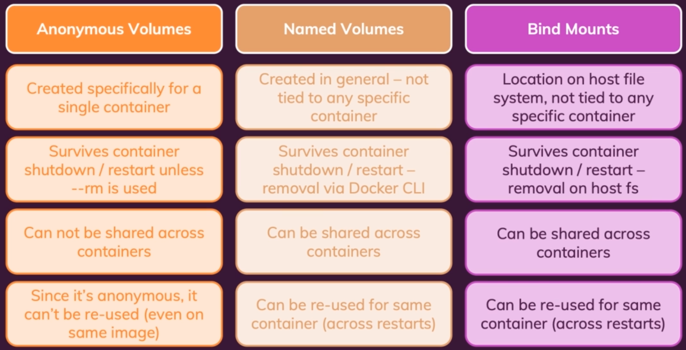

# 1. Introduction to Docker and Containerization.

### 1.1 Virtual Machine vs Containerization:
* Virtual Machines tend to be more  computationally expensive and more complex than containers.
* Virtual Machines can solve the problem handling multiple environments but they waste a lot of computational and storage resource which makes our host system very slow.
* Sharing re-building, and distribution of VMs can be challenging.
* Virtual Machines encapsulate "whole machines" instead of just apps and environments.
* Containers are a more lightweight and easier to use than virtual machines.
* Containers are more portable and can be used on multiple platforms as sharing, re-building and distribution is easy.
* Containers Encapsulates apps/environments instead of whole machines.

# 2. Docker Building Blocks (Images and Containers).

### 2.1 Dockerfile Important Commands:
* `FROM`: This command tells Docker to build a new image from an existing image.
* `RUN`: This command runs a command in the container. We can define simple subcommands along with the RUN instruction that we want to execute inside the container. For example, if we want to install a pip package, we can simply use the “RUN pip install package_name” instruction inside the Dockerfile.
* `COPY`: This command copies files from the host to the container.
* `WORKDIR`: This command changes the current working directory in the container.
* `EXPOSE`: This command exposes a port on the host. This command exposes the specified port but it does not publish/map the container port to the host port. To do that we need to specify `publish` argument with `docker run` as `docker run -p host_port_number:docker_port_number` the `EXPOSE` command is optional, but its a good practice to specify it.
* `ENTRYPOINT`: This command sets the entrypoint of the container. The `ENTRYPOINT` specifies a command that will always be executed when the container starts.
* `CMD`: This command sets the command that is run when the container is started. The `CMD` specifies arguments that will be fed to the `ENTRYPOINT`.

If you want to make an image dedicated to a specific command you will use `ENTRYPOINT ["/path/dedicated_command"]`. Otherwise, if you want to make an image for general purpose, you can leave `ENTRYPOINT` unspecified and use `CMD ["/path/dedicated_command"]` as you will be able to override the setting by supplying arguments to docker run.

### 2.2 Understanding Image Layers:
Images are layer based. An Image is built up from multiple layers based on the different instructions. Every instruction create a layer. These layers are cached. 

When an image is built/re-build only the instruction where change happened and all the instruction after that instruction are reevaluated rest of them are used from cached layers. This speeds up the image build time. In addition an image is read only. It means once an image is built/rebuild it cannot be modified.

### 2.3 Docker run vs start:
* `docker run`: This command creates a new container based of the specified image.
* `docker start`: This command starts a container that is already created.
* If we haven't changed anything i.e. the image is not changed, then there is no need for `docker run` command. We can simply use `docker start` command. With `docker start` command, the container is run in the background. 
* The `docker stop` command does not remove the container data or the data created data while the container was running, if start the container by `docker start`, we can find the data that was previously created, we only loose data when a container is removed.
* The `docker run` command runs in attached mode while `docker start` runs in detached mode. To run a container in detached mode, we need to use the `-d` flag as `docker run -d`.
* We can attach to a detached container by running `docker attach container_id`.
* We can also use `docker logs` to see the logs of a container, and by adding `-f` flag to `docker logs` we can see the logs of a container in real time just as we are attached to the container.

### 2.4 Docker interactive mode:
To run Docker container in interactive mode we can combine `-i` and `-t` flags. For example, `docker run -it` will run the container in interactive mode and attach to it.

* `-i` flag Keep STDIN open even if not attached.
* `-t` flag Allocate a pseudo-TTY.
* If a running container is detached, we can still enter into its interactive mode by using the `docker exec -it` command.
* With `docker start` we can use `-ai` flag to start a container in interactive mode, but this will only work if the container started in interactive mode.

### 2.5 Docker remove container images and containers:
* `docker ps`: This command lists all the containers that are running.
* `docker ps -a`: This command lists all the containers that are running and also stopped.
* `docker rm container_name/id`: This command removes a container. If the container is running, it will be stopped first.
* To delete all the conatiners we can combine the two commands as: `docker rm $(docker ps -a -q)`.
* `docker images`: This command lists all the images that are available.
* `docker rmi image_id`: This command removes an image.
* `docker rmi $(docker images -q)`: This command removes all the images.
* We can only remove those images that are not being used by any container anymore and that includes the stopped containers as well. That is why a container need to be removed first.
* If we want to remove all the image that are not being used by any containers anymore we can use `docker image prune` command.
* One better way is to remove docker containers automatically once they are stopped. We can achieve that by adding `-rm` flag to the `docker run` command as `docker run -rm image_tag/id`.

### 2.6 Inspecting a Docker image:
`docker inspect image_id`: This command is used to inspect the image. It returns a JSON object that contains the image details such as when the image was created, how many layers it has etc.

### 2.7 Copying files to and from a Docker container:
We can copy files to and from a running Docker container using the `docker cp` command.
`docker cp source_path container_id:destination_path`: This command copies a file from the host to the container.
`docker cp container_id:source_path destination_path`: This command copies a file from the container to the host.

### 2.8 Naming and tagging Docker images:
* We can give a name to docker container by providing `--name` flag to the `docker run` command as `docker run --name my-container container_name/id`.
* We can also provide a name and tag to docker image by proving `--tag` and `-t` flags to the `docker build` command as `docker build --tag my-image:1.0`. Name and optionally a tag in the 'name:tag' format.

# 3. Docker Volumes and Managing Data.

### 3.1 Data:
There are three types of data when we consider docker.

* `Application (Code+Environment)`: This data includes the application code and its dependencies. It's written and provided by the developer. This data is added to the image in `build` phase. Once the image is built the data inside it can't be changed i.e. a docker image is immutable and read only.
* `Temporary App Data`: The type of data is produced by the user of application e.g. session data. This data is fetched and produced in the container and stored in the memory or temporary files. It changes dynamically but cleared regularly. It's temporary data hence stored in containers and we can both read write.
* `Permanent App Data`: This type of data is also produced by the user e.g. the user accounts data. Fetched and produced in container. We need to store it permanently and usually it is stored in databases or files. This data must not be lost when we stop/starts the container or we delete the container. We can read and write this type of data & stored with container and volumes.

### 3.2 Docker Volumes:
The data stored inside a container is lost when we remove a container or we run a new container with the same image. We can store the data in a volume and then use it when we run a new container. Volumes helps us to store the data in a persistent way. Volumes are `directories/folders` on the host machine, which are mounted (mapped to a directory inside a container) into the container. Changes in the either the host or the container directory will be reflected in the other directory.

Volume persists if a container is removed or stopped. If a container restarts and mounts the same volume, any data inside that volume is available to the container. Docker provides multiple types of external data storage mechanisms. Such as Volumes (managed by docker) and Bind Mounts (managed by developer). There are further two types of volumes:
* `Anonymous Volumes`: Anonymous volumes are created within the docker file using `VOLUME [ 'path/to/the/volume' ]` command. In anonymous volumes docker sets up a path/directory on the host machine, and the exact location is unknown to the developer. The volumes are managed by `docker volume` command. Once we remove the container, the anonymous volume are removed as well. We can use `docker volume ls` to see the list of volumes. The anonymous volumes are not persistent and have very cryptic names such as `f36167sg898vs726vgv26vg17` i.e. some kind of hash.
* `Named Volumes`: In named volumes the developer can create a volume and then mount it in the container. A defined path in the container is mapped to the created volume/mount i.e. a path on the host machine. Named volumes are great for data which should be persistent but which we don't need to edit directly. The named volumes are not created in the Dockerfile, instead they are created when we run the container e.g. 
 
    ```bash
    docker run -v volume_name:/container/path/to/volume container_name/id

    docker run -v feedback:/app users:latest
    ```

  Named volumes are also managed by docker i.e. we don't specify the path of the directory that would be mapped to container path docker manages this itself. The only difference between `Named Volume` and `Anonymous Volume` is that named volume persists the data because we can identify them by their name while anonymous volume will not persist data because we don't know their name and data is lost once the container is removed. Named volumes can also be create manually with `docker volume create VOLUME_NAME`. They are created in `/var/lib/docker/volumes` and can be referenced to by only their name. Let's say if we create a volume called `mysql_data`, you can just reference to it like this `docker run -v mysql_data:/containerdir IMAGE_NAME`.


### 3.3 Docker Bind Mounts:
Bind mounts are used to mount a host directory into a container. The host directory is mounted into the container at the specified path. The host directory is something that we provide and its not managed by docker, its managed by developer. The path to the host directory should be an absolute path and not the relative path.

```bash
docker run -v absolute/path/to/host/directory:/container/path/to/volume container_name/id

docker run -v /run/media/danish/404/Drives/GoogleDrive/Documents/devops:/app users:latest
```
The path on the host that is mounted to the container and can be accessed from both the container and the host. The changes made in either directory will be reflected in the other directory.

Let's say we are building a node app. There could be a use case where we want to mount our working directory i.e. `app` directory to the container, so that when ever we make a change to our code it'll be reflected in the app running inside the container. That will save us from having to rebuild the container every time we make a change to the code. But the problem associated with this approach is that in our docker image where we have the `app` directory(where we have installed the node modules while building the image), will be overwritten once we mount the `app` directory on our host to the container. As a result the app will not be able to access the node modules because they will be overwritten and removed from container.

The solution to this problems is to use anonymous volume along with bind mount. We'll create a bind mount volume to our `app` directory on our host machine, and apart from that we'll create anonymous volume with this `/app/node_modules` path. This way the `node_modules` directory will be available inside the container and will not be overwritten. Because in docker if there is a conflict between the two volumes, the one with the longer path (deeper path) wins and is not overwritten.

```bash
docker run -v /run/media/danish/404/Drives/GoogleDrive/Documents/devops:/app -v /app/node_modules users:latest
```

### 3.4 Summary of Docker Volumes and Bind Mounts:

* `docker run -v /app/data`: This creates an anonymous volume, can also be created using `VOLUME ['path/to/the/volume']` command inside the Dockerfile.
* `docker run -v data:/app/data`: This creates a named volume, can also be created using `docker volume create VOLUME_NAME` command. The volume can be accessed using `data` i.e its name.
* `docker run -v /path/to/code:/app/code`: This creates a bind mount.
* Following is the summary of all three:
  
  

What you want to use comes mostly down to either preference or your management. If you want to keep everything in the "docker area" (`/var/lib/docker`) you can use volumes. If you want to keep your own directory-structure, you can use binds.

Docker recommends the use of volumes over the use of binds, as volumes are created and managed by docker and binds have a lot more potential of failure (also due to layer 8 problems). If you use binds and want to transfer your containers/applications on another host, you have to rebuild your directory-structure, where as volumes are more uniform on every host.


### 3.5 Read Only volumes:
We can make a volume read-only by adding `:ro` to the end of volume path. This will make the volume read-only and the container will not be able to write to that volume. What if we want to write data to the subdirectory of that volume. That we can do by specifying another volume having the subdirectory path, and we know that in case of path conflict the longer path wins.

```bash
docker run -v /absolute/path/devops:/app:ro -v /app/node_modules -v feedback:/absolute/path/devops/feedback  users:latest
```

### 3.6 Managing Docker Volumes:
Docker volumes provide us various utilities to manage docker volumes. 
* `docker volume ls`: This command lists all the volumes that are managed by docker i.e. named and anonymous volumes.
* `docker volume create VOLUME_NAME`: This command creates a named volume.
* `docker volume rm VOLUME_NAME`: This command removes a named volume, but this volume should not be in use.
* `docker volume inspect VOLUME_NAME`: This command returns the details of a named volume.
* `docker volume prune VOLUME_NAME`: This command prunes/removes the unused named volumes.

### 3.7 Docker Ignore File:
Docker ignore file is a file which is used to ignore files in a directory during a `COPY` command. This is useful when we want to ignore some files in a directory. To use a file in the build context, the `Dockerfile` refers to the file specified in an instruction, for example, a `COPY` instruction. To increase the build’s performance, exclude files and directories by adding a `.dockerignore` file to the context directory. The `.dockerignore` file contains a list of files and directories to ignore and is similar to the `.gitignore` file.

### 3.8 Arguments (ARG) and Environment Variables (ENV):
* Docker support build-time arguments and runtime environment variables.
* Arguments allow us to set flexible bits of data (i.e. variables) in the Dockerfile. 
* Arguments can be used to build a Docker Image with different values by providing the values to the arguments using `--build-arg` option with `docker build` command.
* Environment variables are available inside of the Dockerfile and in application code.
* We set environment variables in the Dockerfile using `ENV` command and provide values to these environment variables using `--env` option with `docker run` command.
* Args and Env variables allow us to create flexible images and containers. 

***Environment Variables:***
* Lets say we have a node app that is listening on port 80 in a container maybe want to change the port later on, so instead of hard coding the port number in `app.listen(80)` we can use environment variable to set the port number by using `process.env.PORT` to access the port number set in Dockerfile and then set the `PORT` environment variable in Dockerfile.
* This way we don't have to build the image every time we need to change the port number. We'll just simply provide the port number using `--env` option with `docker run` command.

```js
app.listen(process.env.PORT);
```

* In Dockerfile we can set the port number using `ENV` command.

```Dockerfile
# here 80 is the default value which we can change when we run the container
ENV PORT=80

# exposing the above mentioned PORT
EXPOSE $PORT

CMD ["node", "app.js"]
```
* We need to specify the environment variables as key values `key1=value1` with `--env` or `-e` flag.
* To run the container with the new port number, we need to publish the same port that we have provided with `--env` flag, we can use the following command to run the container:

```bash
docker run -p 3000:8080 --env PORT=8080 app:latest
```
* We can provide multiple environment variables using `--env`/`-e` flag e.g. `-e key1=value1 -e key2=value2`.
* We can also specify all environment variables in a file often that file is called `Dockerfile.env` or `.env` and specify all the environment variables in the file as follows:

```bash
KEY1=value1
KEY2=value2
```
* Then we can use `--env-file` flag to specify the file path to use the specified environment variables as given by the command below:

```bash
docker run -p 3000:8080 --env-file Dockerfile.env app:latest
```
* This way by using the environment variables we can run the same docker image with different configurations without having to build the image again.

### 3.9 Arguments:
* By using build-time arguments we can specify different values for the arguments during the `docker build` command instead of just hard coding the values in the Dockerfile.
* Let's say in the context of node app the default value to the environment variable `PORT` is hard coded to 80. 
* Let's say we want to change the default value of `PORT` during building the image, we can do this by using build-time arguments.
* We will specify the argument `DEFAULT_PORT` and the default value of the argument is 80 by using `ARG` command in the Dockerfile.

```Dockerfile
ARG DEFAULT_PORT=80

ENV PORT $DEFAULT_PORT

EXPOSE $PORT

CMD ["node", "app.js"]
```

* Now we can build the image with the desired default port number for our node app by specifying the `--build-arg` flag with the desired port number as follows:

```bash
docker build --build-arg DEFAULT_PORT=8000 -t app:latest .
```