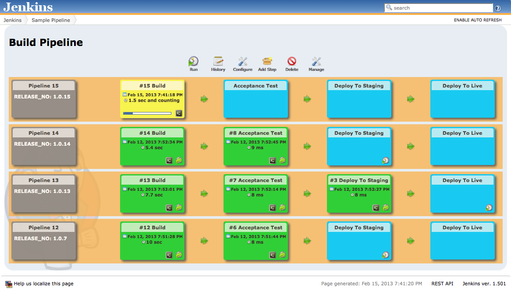

# 4 Jenkins CD:

### 4.1 Tomcat in Staging Environment:
* Tomcat is an application web-server, it executes Java servlet and renders Web pages that include Java Server Page coding. 
* Install tomcat either using the package manager e.g. `pacman` or using `wget` and download the [zip](https://tomcat.apache.org/download-10.cgi) and install.
* If installed with `pacman` the installation will be available at `/etc/tomcat<version_number>`, version_number can be 8, 9 or 10 or something similar.
* Tomcat runs on port `8080` by default but if you want to change the port then you can do it by editing the `server.xml` file. 
* Find the `Connector` tag and change the port to `8080` to desired port and save the file.
* Add the following roles the file `tomcat-users.xml`:

```xml
  <role rolename="manager-script"/>
  <role rolename="admin-gui"/>
  <user username="tomcat" password="tomcat" roles="manager-script,admin-gui"/>
```
* Start the tomcat server by running the following command:

```bash
  sudo systemctl start tomcat
```

### 4.2 Building the app and archiving the build artifacts:
* First we'll create a job to produce `Tomcat Deployable Artifacts`. 
* In CI section we have created artifact, and the artifact was a `jar` file.
* The `jar` file can't be deployed to `Tomcat`.
* In this section we have `Java servlet` project which creates `.war` file.
* We need to install to plugins:
    - `Copy Artifact:` The `Copy Artifact` plugin is used to copy the artifact to the specified directory.
    - `Deploy to Containers:` The `Deploy to Containers`is used to deploy the artifact to the specified container e.g. Tomcat.

* Once both of these plugins are installed, create a new jenkins job with the name `Package_App`, and then, choose `Freestyle Project` and hit ok.
* Configure `Discard old builds` if you want to discard old builds.
* Under source code management choose `git`, and add repository URL (HTTPS/SSH) depending on what you want, in case of SSH you need to choose credentials for the repo. If SSH is not configured yet please configure it using this [guide](../README.md).
* Next check the `Delete workspace before build starts` and `Add timestamps to teh Console Output` under the Build Environment Section.
* Choose the appropriate git branch i.e. `master`, `main` or whatever you want.
* Under `Build Steps` choose `Invoke Top Level Maven Target` and add `clean package` to Goals field, and then click on Advanced section and path (`jenkins/JCE/3-jenkins-cd/pom.xml`) to the `pom.xml` file in the POM field.
* Next click on `Post Build Actions` and choose the `Archive the artifacts` options and the add `**\*.war` to Files to archive field, because we want to archive the artifacts after the build.
* After completing these steps build the job, and check the logs in the `console` tab. Jenkins can take a while for the first time pulling a repository from newly added SSH source.


### 4.3 Deploying to staging environment:
* Once the previous build is completed successfully, we can deploy the artifact to staging environment.
* For that we can create a new job with the name `Deploy_Application_Staging_Env`, and then, choose `Freestyle Project` and hit ok.
* Check the Discard Old Builds and define your strategy.
* This time we'll not be using any source code management.
* Next check the `Delete workspace before build starts` and `Add timestamps to teh Console Output` under the Build Environment Section.
* Under the Build option this time we'll select `Copy artifacts form another project`, and under Project Name fields add `Package_App` job.
* Next under `Which build` field select `Latest successful build` option and check the `Stable build only` i.e. we'll be copying only those artifacts that are latest and built successfully.  
* Next under `Artifacts to copy` field select `**\*.war` to copy the artifact.
* Next move to `Post Build Actions` and choose the `Deploy war/ear to container`.
* In the `WAR/EAR files` field add `**/*.war` and in `Context path` and a forward slash `/`.
* Under the `Containers` field click on `Add Container` and choose the `Tomcat` container with the version that you have installed e.g. `Tomcat 9.x Remote`.
* In the `Containers` box under `Credentials` click on `Add` and then click on `Jenkins`m this will open credentials window, under `Kind` field select `Username with Password`.
* In the username field add `tomcat` and in the `Password` field add `tomcat`, because that's what we've added in the `tomcat-users.xml` file and then click Add.
* Under the `Tomcat URL` add the URL of the tomcat if its on local system then `http:localhost:9090` other wise the IPv4 of your serve e.g. `http://<IPv4>:9090` and then click save.

### 4.4 Linking the two Jobs:
* Now we have created two jobs, and we know that the output or build artifact of the first job (`Package_App`) become input for the second job (`Deploy_Application_Staging_Env`).
* So we can link the two jobs so that once the first job is completed successfully, the second job will be triggered.
* So we can go to `Package_App` job and their we need to `configure` it and in the `Post Build Actions` field select on `Build other projects` and under the `Projects to build field` add `Deploy_Application_Staging_Env` and check `Trigger only if build is stable` option and click Save.
* Apart from that we can configure `Poll SCM` or `GitHub hook trigger for GITScm polling` as `Build Triggers` for our first job, so that whenever code is pushed to the repository, the first job will be triggered.
* Now whenever we trigger the `Package_App` job, and once it's completed it will trigger the `Deploy_Application_Staging_Env` job.


### Build Pipeline Plugin:
* The `Build Pipeline` plugin is a plugin that allows you to create a build pipeline and the plugin provides a `Build Pipeline View` of upstream and downstream connected jobs.
* The plugin gives us the ability to form a chain of jobs based on their upstream/downstream dependencies.
* We can create multiple jobs in a pipeline which will have the parallel upstream or downstream jobs.
* Downstream jobs will be triggered automatically when the upstream jobs are completed successfully, or by suitable authorized user manually triggering it.
* The manual triggers are only available with the `Build Pipeline Plugin`, Jenkins by default does not have the ability to manually trigger the downstream jobs by manual approval.
* An example of `Build Pipeline` is shown below:

<p align="center">

</p>

* Install the `Build Pipeline` plugin form manage jenkins page.
* After installing the plugin, go to Dashboard and click on the `+` button to create a new view, now we will have one more option called `Build Pipeline View`.
* Check the `Build Pipeline View` and provide the appropriate name and click ok.
* Then provide `Build Pipeline View Title`, after that click on `Select Initial Job` and select the `Package_Application` job and click ok.
* This will create the `Build Pipeline View` for our two jobs.


# 5. Jenkins Job DSL(Domain Specific Language):

### 5.1. Jenkins Job DSL:
* With the traditional way of creating jenkins jobs it becomes very difficult to create complex jobs and to manage them.
* We can't perform audit what changes were made by whom, apart from that if something goes wrong we don't have options of Rollbacks.
* Creating jobs manually is a very tedious task and error prone that is why we need code to configure the jobs.
* Jenkins Job DSL is a DSL (Domain Specific Language) that allows you to create jobs in a declarative way (i.e. we can program Jenkins jobs).
* Jenkins `Job DSL` plugin is used to define jobs in programmatic way.
* DSL stands for Domain Specific Language, Jenkins DSL uses groovy as a programming language.
* User can describe the jobs using Groovy Base Script.
* We can create multiple jobs with Jenkins DSL plugin and it comes with lot of benefits like
  - Version Control
  - Audit History
  - Peer Review
  - Rollback
  - BackUp


### 5.2. Jenkins DSL Job Example:
* To use DSL Job first we need to create a `Seed Job`. It is used by Jenkins `Job DSL` plugin to create the DSL job.
* The Seed Job is a Jenkins job which runs DSL scripts, and then generate new jobs.
* The Seed Job must be a Freestyle Project, it can't be a Pipeline or Multi Configuration Job.
* In the Seed Job will add the `Process Job DSL` Build Step. 
* This step takes the DSL scripts and generates the configured Job. 
* Install the `Job DSL` plugins from `Manage Jenkins > Manage Plugins > Available`.
* We can learn how to write groovy scripts from [Jenkins Job DSL API](https://jenkinsci.github.io/job-dsl-plugin/).
* To provide credentials in DSL jobs visit [Credentials](https://github.com/jenkinsci/job-dsl-plugin/wiki/Handling-Credentials) documentation.