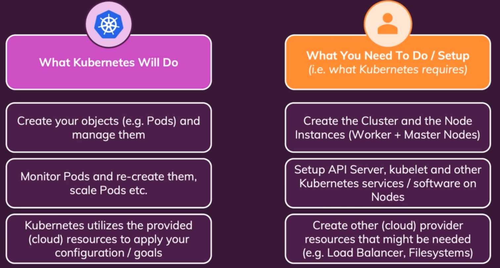
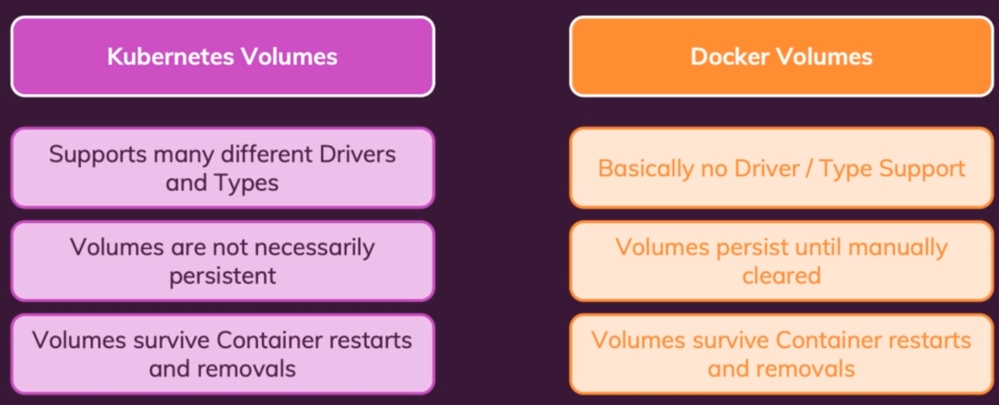
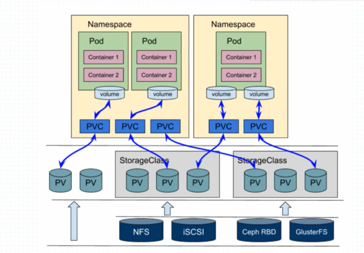
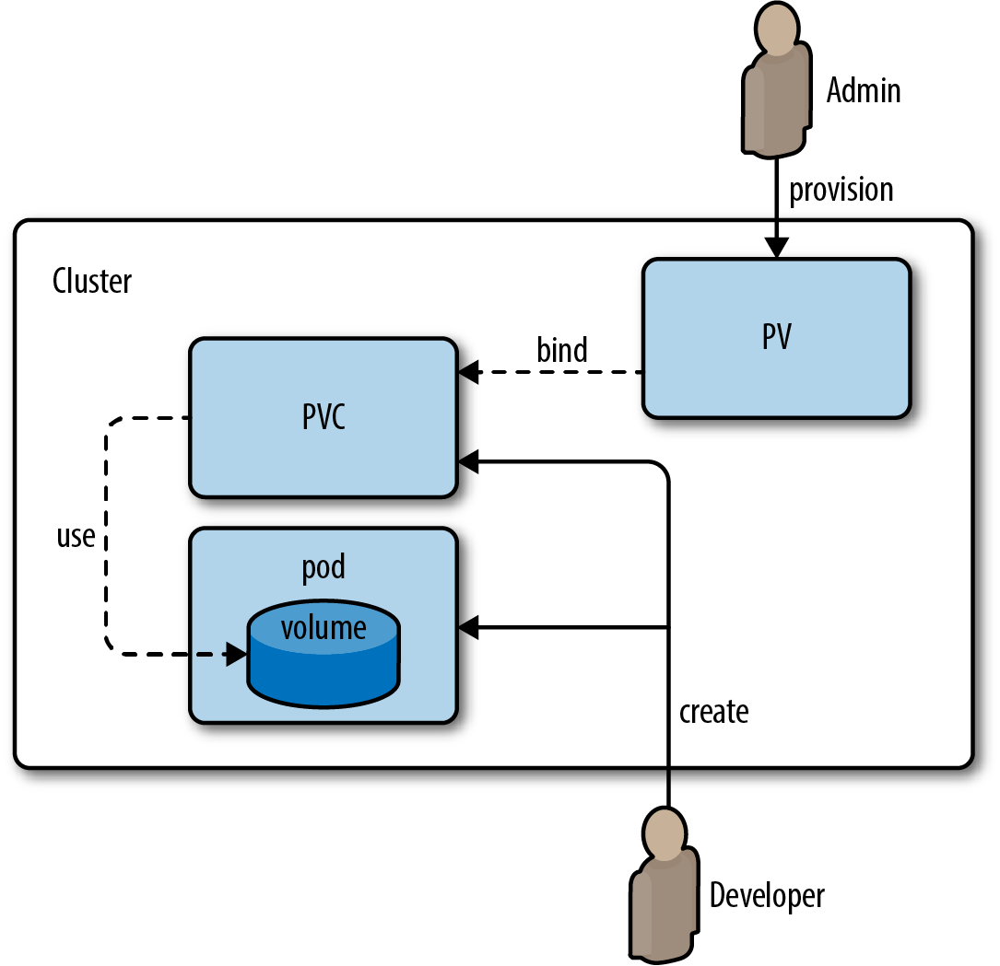

# 1. Introduction to Kubernetes

### 1.1 What is Kubernetes?
* Kubernetes is a portable, extensible, open source platform for managing containerized workloads and services, that facilitates both declarative configuration and automation. 

<p align="center">

</p>

* ***Traditional deployment era:*** Early on, organizations ran applications on physical servers. There was no way to define resource boundaries for applications in a physical server, and this caused resource allocation issues. 
* ***Virtualized deployment era:*** As a solution, virtualization was introduced. It allows us to run multiple Virtual Machines (VMs) on a single physical server's CPU. 
* ***Container deployment era:*** Containers are similar to VMs, but they have relaxed isolation properties to share the Operating System (OS) among the applications. Therefore, containers are considered lightweight. 
* Containers are a good way to bundle and run our applications. In a production environment.
* We need to manage the containers that run the applications and ensure that there is no downtime.
* For example, if a container goes down, another container needs to start. Wouldn't it be easier if this behavior was handled by a system?
* That's how Kubernetes comes to the rescue! Kubernetes provides us with a framework to run distributed systems resiliently. 
* It takes care of scaling and failover for our application, provides deployment patterns, and more. For example, Kubernetes can easily manage a canary deployment for our system.
* Kubernetes provides us with:
    - **Service discovery and load balancing** Kubernetes can expose a container using the DNS name or using their own IP address. If traffic to a container is high, Kubernetes is able to load balance and distribute the network traffic so that the deployment is stable.
    - **Storage orchestration** Kubernetes allows us to automatically mount a storage system of our choice, such as local storages, public cloud providers, and more.
    - **Automated rollouts and rollbacks** us can describe the desired state for our deployed containers using Kubernetes, and it can change the actual state to the desired state at a controlled rate. For example, us can automate Kubernetes to create new containers for our deployment, remove existing containers and adopt all their resources to the new container.
    - **Automatic bin packing** us provide Kubernetes with a cluster of nodes that it can use to run containerized tasks. us tell Kubernetes how much CPU and memory (RAM) each container needs. Kubernetes can fit containers onto our nodes to make the best use of our resources.
    - **Self-healing** Kubernetes restarts containers that fail, replaces containers, kills containers that don't respond to our user-defined health check, and doesn't advertise them to clients until they are ready to serve.
    - **Secret and configuration management** Kubernetes lets us store and manage sensitive information, such as passwords, OAuth tokens, and SSH keys. us can deploy and update secrets and application configuration without rebuilding our container images, and without exposing secrets in our stack configuration.

### 1.2 Why Kubernetes? Amazon ECS vs Kubernetes:
* ***ECS:***
  - Amazon ECS is a proprietary solution that leverages Amazon’s EC2 and Fargate platforms to host Docker containers providing serverless computing, on-demand pricing, scalability, security, reliability, and cost-efficiency.
  - ECS is cloud dependent and only offered by AWS.
  - Initial setup and deployment is very easy on ECS
  - ECS allows up to 120 tasks per instance.
  -  ECS is a proprietary managed service, it offers little in terms of configuration. This is even more true if we use the Fargate platform, as there is no access to cluster nodes, which restrict troubleshooting altogether. 
* ***Kubernetes:***
  - Kubernetes is on the other hand, is an open-source container orchestration solution that can be hosted on many platforms, and offers a lot more flexibility in terms of configuration and non-standard applications. 
  - Kubernetes is cloud agnostic.
  - Kubernetes requires a little more expertise. If us are on EKS, us will have the benefit of setting up through the AWS Management Console, but us will still need to configure and deploy pods via Kops.
  - Kubernetes has much higher limits in general — even supporting up to 750 pods per instance on EKS. These limits may look very important at first glance, but become critical when deploying large apps that require thousands of pods and nodes.
  - Kubernetes, offers flexibility and customizability and we can access cluster nodes and pods directly.

### 1.3 Kubernetes Architecture:
* Kubernetes is a distributed system that is composed of a number of components.
* ***Pods:***
  - Pods are the smallest deployable units of computing that you can create and manage in Kubernetes.
  - A Pod is a group of one or more containers, with shared storage and network resources, and a specification for how to run the containers.
  - A Pod's contents are always co-located and co-scheduled, and run in a shared context. 
  - A Pod models an application-specific "logical host": it contains one or more application containers which are relatively tightly coupled. 
  - In non-cloud contexts, applications executed on the same physical or virtual machine are analogous to cloud applications executed on the same logical host.
  - The shared context of a Pod is a set of Linux namespaces, cgroups, and potentially other facets of isolation - the same things that isolate a Docker container.
  - In terms of Docker concepts, a Pod is similar to a group of Docker containers with shared namespaces and shared filesystem volumes

* ***Worker Node:*** 
  - A Kubernetes cluster consists of a set of worker machines, called nodes, that run containerized applications. Every cluster has at least one worker node.
  - The pod (having a container or multiple containers inside of it) runs on a worker node. 
  - A worker node is a physical machine that is capable of running containers e.g. a virtual machine as EC2 instance on AWS.
  - We can have more than one pods running on a worker node.

* ***Proxy:***
  - A proxy is setup on a worker node by Kubernetes.
  - Kubernetes proxies are used to connect to the outside world.

* When working with kubernetes, we typically need at least one worker node.
* Multiple pods can be created/removed to scale up/down the application.
* We can have different or equal containers running on multiple worker nodes to distribute the load evenly.
* All the worker nodes, pods and the containers running on them need to be controlled e.g. creation, replacement and removal of pods and containers.
* Master node is used to perform creation, replacement or removal of pods and containers using `Control Plane`.
* The control plane's components make global decisions about the cluster (for example, scheduling), as well as detecting and responding to cluster events (for example, starting up a new pod when a deployment's replicas field is unsatisfied).
* Control plane components can be run on any machine in the cluster. However, for simplicity, set up scripts typically start all control plane components on the same machine, and do not run user containers on this machine.
* To ensure high availability the control plane is also setup across multiple machines.
* The control plane is a collection of different tools and services.
* All these things together (worker and master nodes) form a cluster as seen below:

<p align="center">

</p>

* The kubernetes sends all this information to the cloud provider API to create all the resources needed for the cluster desired state.


### 1.4 Kubernetes and Developer Responsibilities:
* Kubernetes will not manage our infrastructure.
* Developer is responsible for creating the cluster and the node instances (worker+master nodes).
* Developer is responsible for setting up API server, kubelet and other kubernetes components on nodes.
* Developer is also responsible for creating cloud provider specific resources such as Load Balancers, Storage, etc. 
* Kubernetes create our object (e.g. pods) and manage them, it will create them automatically distribute them.
* Kubernetes will monitor, re-create and scale up/down the pods.
* Kubernetes utilizes the provided cloud resources to apply our configurations/goals.

### 1.5 Kubernetes Worker Node:
* Worker node can be thought of as a virtual machine e.g. and EC2 instance.
* The worker node is managed by the master node.
* Inside of a worker node we can have one or more pods. 
* A pod can hosts one or more application containers and their resources (e.g. volumes, IP, run config).
* Pods are created and managed by kubernetes i.e. by master node.
* `kubelet` is the component that runs on the worker node and responsible for communication between worker node and master node, so that master node can manage the pods on the worker node.
* `kube-proxy` also runs on the worker node and is responsible for handling incoming and outgoing traffic and only allowed traffic is able to reach the pods.

### 1.6 Kubernetes Master Node:
* `API Server` is the most important component of the kubernetes running on the master node. It is counter point to the `kubelet` service running on the worker node. It is responsible for handling communication between the worker nodes and the master node.
* `Scheduler` is responsible for watching our pods and choosing worker nodes where new pods should be created on. 
* `Kube-Controller-Manager` watches and control worker nodes and ensures correct number of pods are up and running and work closely with `Scheduler` and `API Server`.
* `Cloud-Controller-Manager` is similar to `Kube-Controller-Manager` but for a specific cloud provider and knows how to interact with the cloud provider resources.
* Big Cloud providers like AWS, GCP, Azure, etc. already have services available (e.g. EKS, GKE, AKS, etc.) that can be used to create and manage the cluster and we don't need to create and manage the cluster ourselves.
* We just need to provide our kubernetes configuration and the respective cloud provider will do all the heavy lifting.


# 2. Kubernetes Hands on:

### 2.1 Kubernetes doesn't manage the infrastructure:
* Kubernetes does not manage the infrastructure e.g. setting up VMs, keeping them update and maintaining them.
* Or setting up master and worker nodes, these are the things we need to do either manually or by using a tool like `kubermatic` or by using a kubernetes managed service by a cloud provider such as Amazon EKS.
* Following is the comparison what Kubernetes can do and what we need to do.

<p align="center">

</p>

### 2.2. Kubernetes Objects:
* Kubernetes work with so called objects e.g. pods, services, deployments, services, volume etc.
* Kubernetes objects are the objects that are created by Kubernetes and managed by it.
* We can create a certain object by executing a certain command.
* The objects can be created in two different ways imperatively or declaratively.
* Pods are designed to be ephemeral, kubernetes will start stop and replace them as needed.
* Pods share a lot of concepts of containers.
* Kubernetes manages the pods for us i.e. the whole deployment of applications.

### 2.3. Deployment Object:
* We don't create a pod object our own instead we create deployment object, and give it instructions about number of pods and teh containers that it should create and manage for us.
* Deployment object can create and manage multiple pods. The Deployment object is under the hood is the controller object.
* We describe a desired state in a Deployment, and the Deployment Controller changes the actual state to the desired state at a controlled rate.
* It define which Pods and containers to run and the number of Pods to run and where to place these pods i.e. on which machines.
* Deployments can be paused, deleted and rolled back.
* Deployments can also be scaled dynamically and automatically i.e. autoscaling on the basis of certain metrics. 
* Deployment can be created by specifying following command:

```bash
kubectl create deployment first-app --image=irdanish11/kub-first-app-01
```
* Make sure the image is available on a container registry because locally created images will not work and the deployment will fail.
* We can check the status of deployment and pods by following commands:

```bash
kubectl get deployment
kubectl get pods
```
* To view the minikube dashboard, run the following command

```bash
minikube dashboard
```

### 2.4. Kubernetes Services:
* When we create deployment object, at that time we can't reach the Pod or the container running inside the container.
* To reach the Pod or the Container running inside the Pod, we need a service.
* The Services are responsible to expose pods to other pods on the cluster or to the visitors outside the cluster i.e. to thw world.
* Pod does have an IP address, we can't use that to access the pod outside from the cluster and secondly it changes when a pod is replaced. 
* Services group pods with a shared IP address and that IP address wont change.
* We can use Services to move multiple pods into a service to make them reachable on that service using unchanging IP addresses.
* The default a service is internal only but we can override it to make that service accessible externally.
* Without Services Pods are hard to reach even within the cluster because of the changing IP addresses problem.
* Instead of using `kubectl service` we can use `kubectl expose` command to expose a service.

```bash
kubectl expose deployment first-app --type=LoadBalancer --port=8080
```

* The `--port` flag specifies the port of the application which is exposed as in our case we've exposed port `8080` in our Dockerfile.
* The `--type` flag specifies the type of service we want to create. There are many options available, the default option is `ClusterIP`, which is used to create a service that is accessible from within the cluster.
* The other option is `NodePort`, which is used to connect to the service from outside the cluster.
* Another option is `LoadBalancer`, which is used to create a service that is accessible from outside the cluster along with the benefits of a load balancer. 
* The `LoadBalancer` option only works if our infrastructure supports it, AWS supports the `LoadBalancer` option and `minikube` also supports it.
* We can check whether the service is created successfully by following command:

```bash
kubectl get services
```
* In the `minikube` environment, the `EXTERNAL-IP` will always have `<pending>` status, the private IP will be assigned only when we are running Kubernetes on a Cloud.
* `minikube` have a command that will give us access to the service by mapping a port to an IP which we can reach from our local machine.
* The command is as follows:
  
```bash
minikube service first-app
```
* This will give us an IP address to access our service.
* The approach that we have used here is `imperative`, because we have defined the flow of the execution of different tasks.


### 2.5. Kubernetes Scaling:
* Let's say we haven't set up autoscaling, so kubernetes will not be creating or removing pods automatically but we have to do this manually.
* So we can manually set scaling i.e. replicas of a deployment.
* We can take advantage of load balancing because our deployment is using `LoadBalancer` option, which automatically balance the traffic between any number of pods that are available.
* We scale our deployment using following command:

```bash
kubectl scale deployment first-app --replicas=3
```

* The `--replicas` flag specifies the number of replicas of the pods that we want to create.
* We can scale down to any number of pods by using the same command but providing less number of replicas e.g. now we'll scale down to 1 pod.

```bash
kubectl scale deployment first-app --replicas=1
```

### 2.6. Updating the Deployment:
* Now let's say have updated our application and as a result we want to update the deployment as well.
* To do that first we need to re-build our image and push to the DockerHub or any container registry.
* Now its time to update our deployment, and to do that we can use the following command:

```bash
kubectl set image deployment/first-app kub-first-app-01=irdanish11/kub-first-app-01
```

* If we just run the above command we'll not see and update because kucbectl will not update the deployment if the image is the same.
* The image is same because we haven't updated the tag of the image.
* So in order to do that we need to build our images with tags, and the tag could be an incrementing number of maybe current datetime.

```bash
docker build -t irdanish11/kub-first-app-01:2 .
```
* Or maybe we can use date time:

```bash
docker build -t irdanish11/kub-first-app-01:$(date +%Y%m%d%H%M) .
```

* Now we will use the tag of the image and all will be good:

```bash
kubectl set image deployment/first-app kub-first-app-01=irdanish11/kub-first-app-01:2
```

* We can view the current updating status by running the following command:

```bash
kubectl rollout status deployment/first-app
```

### 2.7. Deployments Rollback and History:
* Now let's update our Deployment with an image tag that doesn't exist:

```bash
kubectl set image deployment/first-app kub-first-app-01=irdanish11/kub-first-app-01:2
```

* Now let's check the status of the deployment update:

```bash
kubectl rollout status deployment/first-app
```

* Now as this image does not exist the output of the above command will look like this:

```bash
Waiting for deployment "first-app" rollout to finish: 1 old replicas are pending termination...
```

* That means that the old pod has not terminated yet, why its not terminated we can check that in our `dashboard` under `pods` option or by using `kubectl get pods` command.
* The reason for old replica to be not terminated yet is that because the new replica is not starting up successfully and it is facing issues pulling the image.
* Kubernetes uses a rolling update strategy to update the pods i.e. first it create the new replica, once the new replica is created successfully, only then it removes the old replica.
* So in our case update never finishes, and in that case we need to rollback this update.
* To rollback we can use the following command:

```bash
kubectl rollout undo deployment/first-app
```

* Now we can check the status of the deployment rollback:

```bash
kubectl rollout status deployment/first-app
```

* Now the update/rollback is successfully.
* We can check the history of the deployment by using the following command:

```bash
kubectl rollout history deployment/first-app
```

* We can also have details about the deployment by using the following command:

```bash
kubectl rollout history deployment/first-app --revision=1
```

* The `--revision` flag specifies the revision of the deployment we want to see the history of.
* We can see that revision 1 is our original deployment.
* Now let's say we want to go back to the original deployment to do that we just need to use the `--to-revision` flag and provide the revision identifier to the flag along with our `rollout undo` command.

```bash
kubectl rollout undo deployment/first-app --to-revision=1
```

* Until now whatever we have done is by `imperative` approach next we'll do everything by using `declarative` approach.
* Now let's cleanup what we've created until now by using following commands:
  
```bash
kubectl delete service first-app
kubectl delete deployment first-app
```

### 2.8. Imperative vs Declarative Approach:
* Until now whatever we have done is by `imperative` approach, by typing commands individually.
* As in the case of running docker containers manually bt typing commands and providing different configuration flags which was time consuming, so to solve that problem we have used `docker-compose` to define all the configurations to run a container in a `docker-compose.yml` and then just do `docker compose up` to start the container/s.
* Now we are facing similar sort of problem that now we have to type the commands using `kubectl` and we want a similar solution to `docker-compose`. 
* We need a file where we can define our `deployment` and `service` configurations and then apply that file to our Kubernetes file.
* Kubernetes provides us such a file called `Resource Definition` file. We can define different objects that Kubernetes understand e.g. `deployment`, `service`, `pod`, `ingress`, `configmap`, `secret`, etc.
* Following is an example of a `Resource Definition` file:

```yaml
apiVersion: apps/v1
kind: Deployment
metadata:
  name: nginx-deployment
  labels:
    app: nginx
spec:
  replicas: 3
  selector:
    matchLabels:
      app: nginx
  template:
    metadata:
      labels:
        app: nginx
    spec:
      containers:
      - name: nginx
        image: nginx:1.14.2
        ports:
        - containerPort: 80
```

* It creates a ReplicaSet to bring up three `nginx` pods.
* After defining the `Resource Definition` or `config` file we can use the following command to apply the file to our Kubernetes cluster:

```bash
kubectl apply -f <name-of-config-file>.yaml
```
* This `config` file is used to define our desired target state and whenever we apply it to our cluster, Kubernetes will take the desired state and make it our current state by creating/removing/updating the objects defined in the file.

### 2.9. Creating a Deployment Configuration file:
* The first thing we need to define in  configuration file is `apiVersion`. To do that the best practice is that we checkout the docs to find out the version of the API e.g. `apiVersion: v1`.
* The second thing we need to define is the `kind`, which is the type of the object we want to create. The possible values for kind can be `Pods`, `Deployment`, `Service`, `Ingress`, `ConfigMap`, `Secret`, etc an example would be `kind: Deployment`. For more details visit [documentation](https://kubernetes.io/docs/reference/generated/kubernetes-api/v1.24/#deployment-v1-apps).
* The next thing we add is the `metadata` section, which is used to define the metadata of the object. It's a nested yaml object. We can define different types of values for the `metadata` section, which are related to our configuration. For further detail visit [documentation](https://kubernetes.io/docs/reference/generated/kubernetes-api/v1.24/#objectmeta-v1-meta). An example would be:

```yaml
metadata:
  name: nginx-deployment
  labels:
    app: nginx
```

* Next we need to add the specification of the object by using `spec`. Here we defined the different behavior and needs of the defined object. In our case we are creating the `Deployment` object in this example.


* In spec for [Deployment](https://kubernetes.io/docs/reference/generated/kubernetes-api/v1.24/#deploymentspec-v1-apps) object we can define following things:
  - `replicas`: Number of desired pods. This is a pointer to distinguish between explicit zero and not specified. Defaults to 1.
  - `selector`: Next we need to define another important thing and that is the `selector` field which is a map of key-value pairs. The key either should be `matchLabels` or `matchExpression`. 
    1. Selector is label selector for pods. Existing ReplicaSets whose pods are selected by this will be the ones affected by this deployment. It must match the pod template's labels.
    2. Here we'll use `matchLabels` which is a map of key-value pairs of the pod labels because we want to select only those pods for this deployment that are defined in this deployment.
    3. Deployments are dynamic objects that means they have the ability to scale, so the deployments continuously look for the pods that it should control.
    4. That is why we need to provide labels of our pods to the selector so that our deployment should know that these are the pods that I should control.
    5. We need to define map of key-value pairs under the `matchLabels`, the key-value pairs should be the same as defined under `labels` key of `template` in `spec` field. 

  - `template`: Template describes the pods that will be created. The template is a nested object which requires `metadata` and `spec` fields to be defined. 
    1. One important thing here is that we don't need to define the `kind` field here because for the `Deployment` object by default Kubernetes consider it to be a `Pod` object. That's why its type is `PodTemplateSpec`. For further details visit [documentation](https://kubernetes.io/docs/reference/generated/kubernetes-api/v1.24/#podtemplatespec-v1-core).
    2. In the `metadata` field of `template` we can defined `labels` field which is a map of key-value pairs. Both the key and the value is up to the developer to choose.
    3. The `spec` field of `template` is a nested object of type [PodSpec](https://kubernetes.io/docs/reference/generated/kubernetes-api/v1.24/#podspec-v1-core). Under the `spec` we will define [containers](https://kubernetes.io/docs/reference/generated/kubernetes-api/v1.24/#container-v1-core) field which is a list of containers belonging to the pod. Containers cannot currently be added or removed. There must be at least one container in a Pod. Cannot be updated. 
  - We can also define other fields for that check the documentation for [Deployment](https://kubernetes.io/docs/reference/generated/kubernetes-api/v1.24/#podspec-v1-core) object.
  

* Following is our `Deployment` configuration file:

```yaml
apiVersion: apps/v1
kind: Deployment
metadata:
  name: second-app-deployment
  group: example
spec:
  replicas: 1
  selector:
    matchLabels:
      app: second-app
      tier: backend
  template: 
    metadata:
      labels:
        app: second-app
        tier: backend
    spec:
      containers: 
        - name: second-node-app
          image: irdanish11/kub-first-app-01:2
        #- name: python-app
        #  image: irdanish11/kub-second-app:2
``` 
* Now we can apply this configuration file to our cluster by using the `kubectl apply` command and specifying the `-f` flag provided with the path to the configuration file.

```bash
kubectl apply -f <name-of-config-file>.yaml
```

* We can provide multiple configuration files by providing specifying multiple `-f` flags.

```bash
kubectl apply -f <name-of-config-file-1>.yaml -f <name-of-config-file-2>.yaml
```

### 2.10. Defining Service object:
* Until now we have created our deployment but we can't reach our application because we haven't exposed it yet.
* To do that we need to define `Service` object.
* Now we'll create our `service.yaml` file which will be very similar to our `deployment.yaml` file. 
* Obviously the first thing we need to define is the `apiVersion` which in the case of `Service` will be `v1` only as we can check from the [documentation](https://kubernetes.io/docs/reference/generated/kubernetes-api/v1.24/#service-v1-core) as well.
* This because the group for the `Services` is `core` that means we don't need to specify `core/v1` instead we can specify `v1` only.
* Then we'll define `kind` which would be the `Service`.
* In the selector field we should define which pods should be connected to this service. The `selector` is a map of key-value pair i.e. the `labels` that we have defined under the `metadata` field of `template` of `spec` field in the `Deployment` object.
* We'll just copy those tags and paste them as follows:

```yaml
selector:
    app: second-app
```

* Note here we don't need to specify `matchLabels` or `matchExpression` because the `selector` field in the Service object only takes labels only.
* Another thing to note here is that here we only specified one label which is `app: second-app`, this because here we want that all of the pods that have the label of `app` and the value of `second-app` should be connected to this service and not just only the pod with `backend` label. Because we can have multiple pods that can have `app: second-app` label such as pods of frontend `tier` or maybe another backend `tier`.
* When we were using imperative approach to define a service we've defined `ports` and `type` so here we should do that as well.
* The [ports](https://kubernetes.io/docs/reference/generated/kubernetes-api/v1.24/#serviceport-v1-core) should be a list of map of key/value pairs, each map should at least contain  following three values:
  - `protocol`: The IP protocol for this port. Supports "TCP", "UDP", and "SCTP". Default is TCP. 
  - `port`: The port that will be exposed by this service.
  - `targetPort`: Number or name of the port to access on the pods targeted by the service i.e. the port on which our app is running. Number must be in the range 1 to 65535.

* An example of ports is given below:

```yaml
ports:
  - protocol: TCP
    port: 80
    targetPort: 8080
  - protocol: TCP
    port: 443
    targetPort: 443
```

* Next we need to define the `type` option, type determines how the Service is exposed. Defaults to ClusterIP. Valid options are ExternalName, ClusterIP, NodePort, and LoadBalancer. "ClusterIP" allocates a cluster-internal IP address for load-balancing to endpoints. `LoadBalancer` builds on NodePort and creates an external load-balancer (if supported in the current cloud) which routes to the same endpoints as the clusterIP. In local case it'll be using load balancer of minikube.
* An example `service.yaml` file is given below:

```yaml
apiVersion: v1
kind: Service
metadata:
  name: backend
  group: example
spec:
  selector:
    app: second-app
  ports:
    - protocol: TCP
      port: 80
      targetPort: 8080
  type: LoadBalancer
```

### 2.11. Updating and Deleting Resources:
* To update or make changes to our Deployments, Services e.t.c all we need is to change our `Resource Definition` files as per our need and then just simply apply the newly changed `Resource Definition` files.
* Let's say we want to scale our deployment to the 3 pods, we'll just update our `replicas` field in the `deployment.yaml` and apply it and we'll have new deployment with 3 pods.
* If we want to delete any of the objects that we have created (e.g. Deployment, Service etc) we can use the `kubectl delete` command along with `-f` flag which points the path to the config file, to delete the objects in that file.
* Following is an example to delete command:

```bash
kubectl delete -f=<name-of-config-file>.yaml -f=<name-of-config-file-2>.yaml
```

### 2.12. Multiple vs Single Config Files:
* We can merge multiple files into one files as in our case we say that the Resource Definitions in the `services.yaml` file is closely related to the Resource Definition in the `deployment.yaml` file.
* We can merge them into one file. 
* When merging multiple Resource Definitions into one single file we need to use three hyphens `---` as a separator between each Resource Definition.
* An example config file which contains the `Service` and `Deployment` Resource Definitions is given below:

```yaml
apiVersion: v1
kind: Service
metadata:
  name: backend
  group: example
spec:
  selector:
    app: second-app
  ports:
    - protocol: TCP
      port: 80
      targetPort: 8080
  type: LoadBalancer

---

apiVersion: apps/v1
kind: Deployment
metadata:
  name: second-app-deployment
  group: example
spec:
  replicas: 1
  selector:
    matchLabels:
      app: second-app
      tier: backend
  template: 
    metadata:
      labels:
        app: second-app
        tier: backend
    spec:
      containers: 
        - name: second-node-app
          image: irdanish11/kub-first-app-01:2
        #- name: python-app
        #  image: irdanish11/kub-second-app:2
```
* One thing to note here is that we have moved the `Service` resource definition to the top of the file because the resource definition are created in top to bottom fashion.
* As our `Service` object is dynamic and it will look for all the pods with labels of `app: second-app` in the cluster it makes sense that it should get created first.
* Whenever a new pod will created with the label of `app: second-app` it will be automatically added to this `Service`.


### 2.13. Labels and Selectors:
* Selectors are used to connect other resources to a resource e.g. connecting pods to deployment or a service.  
* There are multiple types of selector simple ones as we've used in service and the modern ones in the deployment e.g. `matchLabels.
* We can delete an object by using its labels as well, we need to provide `-l` flag and provide it with appropriate labels.

```bash
kubectl delete -l group=example
```

* The above commands will delete all the resources associated to the `group: example` to avoid that we can define services that we want to delete that have these labels.

```bash
kubectl delete deployments,services -l group=example
```

* We can also delete a service by its name just using the following as we did in imperative approach.

```
kubectl delete second-app-deployment
```


### 2.14. Liveness Probes
* How Kubernetes check whether the pods or containers in the pods are healthy or not. Until we have been using the default behavior for liveness probes.
* But this is something that we can configure because this matters in certain applications.
* We can change the default behavior of a container by adding [livenessProbe](https://kubernetes.io/docs/reference/generated/kubernetes-api/v1.24/#probe-v1-core) key, which is available under [containers](https://kubernetes.io/docs/reference/generated/kubernetes-api/v1.24/#container-v1-core) as `spec > template > spec > containers` field.
  
* Probe describes a health check to be performed against a container to determine whether it is alive or ready to receive traffic.
* There are multiple methods the way we can probe a container to probe for liveness e.g.  `httpGet`, `tcpSocket`, `grpc`, `timeoutSeconds`, `periodSeconds` etc.
* Here we'll do [httpGet](https://kubernetes.io/docs/reference/generated/kubernetes-api/v1.24/#httpgetaction-v1-core) probe, and we need to specify the `path` and `port` of the service that we want to probe, and apart from that we'll also use `periodSeconds` probe to define the interval of time between two successive probes and `initialDelaySeconds` to define the time to wait before the first probe.
* An example is given below:

```yaml
containers: 
  - name: second-node-app
    image: irdanish11/kub-first-app-01:2
    livenessProbe:
      httpGet:
        path: /
        port: 8080
      periodSeconds: 5
      initialDelaySeconds: 5
```

* We can also provide docker container specific information such as providing the Arguments to the entry point, environment variables, volumes etc. For this information visit the documentation for [containers](https://kubernetes.io/docs/reference/generated/kubernetes-api/v1.24/#container-v1-core).


# 3. Managing Data & Volumes with Kubernetes:

### 3.1. Kubernetes Volumes:
* Kubernetes can mount volumes into containers.
* A broad variety of volume types/drivers are supported:
  - Local Volumes (i.e. on Nodes).
  - Cloud-provider specific volumes.
* Volume lifetime depends on the Pod lifetime, because the Volumes are the part of the Pods which are started and managed by Kubernetes, volumes are Pod specific.
  - Volumes survives Container restarts and removals.
  - Volumes are removed when the Pod is destroyed.
* Kubernetes Volumes are different to the Container Volumes, a comparison is given below:

<p align="center">

</p>

* There are different types of Kubernetes Volumes, as they these volumes are not a directory on our local machines. Learn more about [Volumes](https://kubernetes.io/docs/concepts/storage/volumes/) from docs.
* We'll be looking at following types of Kubernetes Volumes:
  - [csi](https://kubernetes.io/blog/2019/01/15/container-storage-interface-ga/)
  - [emptyDir](https://kubernetes.io/docs/concepts/storage/volumes/#emptydir)
  - [hostPath](https://kubernetes.io/docs/concepts/storage/volumes/#hostpath)
  - [nfs](https://kubernetes.io/docs/concepts/storage/volumes/#nfs)

### 3.2. emptyDir Volume:
* We have added `/error` path in our node app so that whenever we go to that path the app crashes and container restarts, this will help understand concept of Kubernetes Volumes.
* We need to define the [Volume](https://kubernetes.io/docs/reference/generated/kubernetes-api/v1.24/#volume-v1-core) where we define the spec of the [pod](https://kubernetes.io/docs/reference/generated/kubernetes-api/v1.24/#podspec-v1-core) i.e. in the `deployment.yaml` file under `Deployment > spec > template > spec > volumes`.
* Volumes is a List of volumes that can be mounted by containers belonging to the pod.
* Each list element should be a map of key-value pairs of the form:

```yaml
  - name: <name>
    <type_of_the_volume>: <volume_config_or_{}_for_defaults>
```

* Type of the volumes can be `emptyDir`, `hostPath` etc. An example of Volume configuration is given below:

```yaml
  - name: story-volume
    emptyDir: {}
```

* In above Volume configuration the `{}` is used to define the default values for the emptyDir volume.
* We have used [emptyDir](https://kubernetes.io/docs/concepts/storage/volumes/#emptydir) type of volume, an [emptyDir](https://kubernetes.io/docs/reference/generated/kubernetes-api/v1.24/#emptydirvolumesource-v1-core) volume is first created when a Pod is assigned to a node, and exists as long as that Pod is running on that node. As the name says, the `emptyDir` volume is initially empty. 
* All containers in the Pod can read and write the same files in the emptyDir volume, though that volume can be mounted at the same or different paths in each container.
* When a Pod is removed from a node for any reason, the data in the emptyDir is deleted permanently.
* A container crashing does not remove a Pod from a node. The data in an emptyDir volume is safe across container crashes.
* Next we need to bind our volumes to our [containers](https://kubernetes.io/docs/reference/generated/kubernetes-api/v1.24/#container-v1-core). That can be configured in the `deployment.yaml` file under `Deployment > spec > template > spec > containers > volumeMounts`.
* We can bind volume to a [container](https://kubernetes.io/docs/reference/generated/kubernetes-api/v1.24/#container-v1-core) by using `volumeMounts` which defines Pod volumes to mount into the container's filesystem. Cannot be updated.
* [volumeMounts](https://kubernetes.io/docs/reference/generated/kubernetes-api/v1.24/#volumemount-v1-core) should be a List. Each list element should be a map of key-value pairs of the form:

```yaml
  - name: <name>
    mountPath: <path>
``` 

* The `name` is the name of the volume (the volume name should be same as defined in the Volumes section) that we want to mount and the `mountPath` is the path in our container's filesystem where we want to mount the volume.

### 3.3. hostPath Volume:
* As the volumes are tightly coupled with pods, so in case if our container crashes and being restarted, we'll not be able to access the volume. 
* Even we have multiple replicas for the same pod, we'll not be able to access the volume when we use `emptyDir` type of volume, because the other pods doesn't know about that volume. 
* Because the `emptyDir` type of volume creates `emptyDir` volume per pod.
* There are a lot of ways to handle this but one way to handle this is by using [hostPath](https://kubernetes.io/docs/concepts/storage/volumes/#hostpath) type of volume.
* A hostPath volume mounts a file or directory from the host node's filesystem into your Pod. 
* That means that the any other on the same machine, can access the volume, & this way multiple pods can access the shared volume.  
* [hostPath](https://kubernetes.io/docs/reference/generated/kubernetes-api/v1.24/#hostpathvolumesource-v1-core) is somewhat similar to `bindMount` in the sense that it mounts a file or directory from the host node's filesystem into your Pod.
* In case of `hostPath` type of volume, we will configure it by providing the `path` of the machine/node that would be mounted as a volume and the `type` which should define whether the directory already exists then use `Directory` or if not then create directory by using `DirectoryOrCreate`.
* Following is an example of `hostPath` volume configuration:

```yaml
  - name: story-volume
    hostPath:
      path: /data
      type: DirectoryOrCreate
```
* Apart from that we don't need to configure or change anything.


### 3.4. CSI Volumes:
* [CSI](https://kubernetes.io/blog/2019/01/15/container-storage-interface-ga/) is a new storage interface for Kubernetes that allows for the definition of storage resources in a declarative manner. 
* CSI was developed as a standard for exposing arbitrary block and file storage storage systems to containerized workloads on Container Orchestration Systems (COs) like Kubernetes.
* With the adoption of the Container Storage Interface, the Kubernetes volume layer becomes truly extensible. 
* Using CSI, third-party storage providers can write and deploy plugins exposing new storage systems in Kubernetes without ever having to touch the core Kubernetes code.
* This gives Kubernetes users more options for storage and makes the system more secure and reliable.
* Some Volume types that uses CSI driver are:
  - [AWS EBS CSI migration](https://kubernetes.io/docs/concepts/storage/volumes/#aws-ebs-csi-migration)
  - [Amazon EFS CSI driver](https://docs.aws.amazon.com/eks/latest/userguide/efs-csi.html)
  - [AWS EFS CSI Driver Github](https://github.com/kubernetes-sigs/aws-efs-csi-driver)
  - [azureDisk  CSI migration](https://kubernetes.io/docs/concepts/storage/volumes/#azuredisk-csi-migration)
  - [azureFile CSI migration](https://kubernetes.io/docs/concepts/storage/volumes/#azurefile-csi-migration)

### 3.5. Kubernetes Persistent Volumes:
* The Volumes that we have seen until now are destroyed once the pod is removed or terminated.
* Same is the case when we scale our pods up the newly created pods dose not have the access to the volumes, `hostPath` solves this problem but for one thing it is not a secure method secondly it does not work if newly created pod is created on some other node (i.e. some other machine) than the one that was used to create the volume.
* Often we need pod or node independent volumes e.g. in the case of container having database or a container writing files.
* To solve these volumes Kubernetes provide us with pod/node independent volumes which are called [Persistent Volumes](https://kubernetes.io/docs/concepts/storage/persistent-volumes/).
* A lot of the volume types that we have seen earlier are also persistent volumes e.g. `AWS EBS CSI migration` or `azureDisk CSI migration` etc, because they provide independent storage.
* But the Kubernetes `Persistent Volumes (PV)` is not only about independent storage but the Persistent Volumes are detached from the Pod and independent of the pod lifecycle.
* It gives more power as cluster administrator and we don't need to configure it multiple times in different pods or deployments, instead we'll define it once and use it everywhere.
* A PersistentVolume (PV) is a piece of storage in the cluster that has been provisioned by an administrator or dynamically provisioned using Storage Classes.
*  It is a resource in the cluster just like a node is a cluster resource.
*  `PVs` are volume plugins like Volumes, but have a lifecycle independent of any individual Pod that uses the PV.
*  A `PersistentVolumeClaim (PVC)` is a request for storage by a user. It is similar to a Pod. 
*  Pods consume node resources and PVCs consume PV resources.

<p align="center">

</p>

*  Pods can request specific levels of resources (CPU and Memory). Claims can request specific size and access modes (e.g., they can be mounted ReadWriteOnce, ReadOnlyMany or ReadWriteMany, see [AccessModes](https://kubernetes.io/docs/concepts/storage/persistent-volumes/#access-modes)).
*  A working example of [PV](https://kubernetes.io/docs/tasks/configure-pod-container/configure-persistent-volume-storage/)
*  While PersistentVolumeClaims allow a user to consume abstract storage resources, it is common that users need PersistentVolumes with varying properties, such as performance, for different problems. 
*   Cluster administrators need to be able to offer a variety of PersistentVolumes that differ in more ways than size and access modes, without exposing users to the details of how those volumes are implemented. For these needs, there is the StorageClass resource.

<p align="center">

</p>

* Some types of PV [types](https://kubernetes.io/docs/concepts/storage/persistent-volumes/#types-of-persistent-volumes).