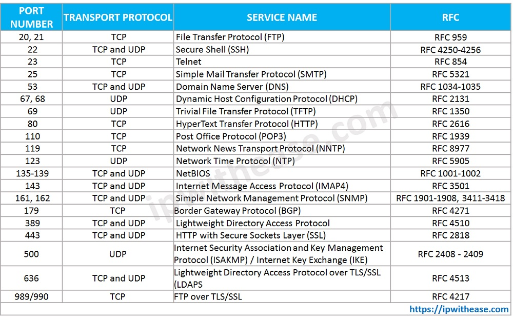

# 4 Linux
Some useful linux commands to see resources:
* `uptime`: Shows how long the system has been running.
* `free`: Shows how much memory is free and how much is used.
* `df -h`: Shows how much disk space is free and how much is used.
* `less /proc/cpuinfo`: Shows the number of CPUs and their speed.
* `less /proc/meminfo`: Shows the amount of memory installed.
* `less /proc/net/dev`: Shows the network interfaces and their status.
* `less /proc/net/wireless`: Shows the wireless network interfaces and their status.
* `less /proc/net/arp`: Shows the ARP table.
* `lscpu`: CPU architecture information from sysfs and /proc/cpuinfo.
* `lsusb`: USB devices connected to the system.
* `lsblk`: Block devices connected to the system.
* `lspci`: PCI devices connected to the system.
* `lshw -C <device e.g. cpu, memory>`: List hardware information.
* `sudo dmidecode -t <device e.g. cpu, memory>`: Its a tool for retrieving hardware information of any Linux system. It dumps a computer’s DMI (a.k.a SMBIOS) table contents in a human-readable format for easy retrieval.
* `nproc`: Shows the number of processors.
* `hwinfo`: Shows the hardware information.
* `xargs`: Some of the commands in linux/unix does not accept piped input `xargs` can take the output(piped output) from one command and send it to another command as parameters.


### 4.1 File Types:
In linux everything is a file. There are multiple types of files.
* `ls -l`: Lists the files in the current directory using a long listing format. Such as `-rw-r--r-- 1 user group 1234 1234 filename`, `drwxrwxrwx 1 user group 1234 1234 filename`.
* `file name_file`: Shows the type of the file.

* `-`: Single hypen in the start indicates whether the given file is a normal file (e.g. text, ASCII file) or its a binary file (e.g. executable file).
* `d`: D in the start indicates that the type of file is directory.
* `c`: C in the start indicates that the type of file is character device. Such as keyboard, mouse, tty. These files are often found in `/dev` directory.
* `b`: B in the start indicates that the type of file is block device. Such as hard disk, floppy disk, CD-ROM.
* `p`: P in the start indicates that the type of file is pipe. A special file that allows processes to communicate with each other without using network socket semantics.
* `s`: S in the start indicates that the type of file is socket. A special file that provides inter-process networking protected by the file system's access control.
* `l`: L in the start indicates that the type of file is symbolic link.
* `u`: U in the start indicates that the type of file is unknown.
* `w`: W in the start indicates that the type of file is a named pipe (fifo).

* `ln -s`: Creates a symbolic link.

### 4.2 Filters:
We can use `grep` to filter the files. 
* `grep keyword_search filename`: Searches the file for the keyword. If the keyword is found, the lines containing the keyword are printed.
* `grep -i keyword_search filename`: Searches the file for the keyword ignoring the case. If the keyword is found, the lines containing the keyword are printed.
* `grep keyword_search *`: Searches all the files in the current directory. 
* `grep -R keyword_search directory`: Searches all the files in the directory and subdirectories.
* `grep -v keyword_search filename`: Displays the lines in the file that do not contain the keyword. It is called reverse search.


* `less filename`: Displays the file in the terminal. It is a filereader. Less is very good for reading large files because with large input files it starts up faster than text editors like vi/vim. To navigate the file, we can use arrow keys or vim navigation keys.
* `more filename`: More is a similar utility to less. It is a file reader. It is similar to less but it displays the file in the terminal in pages. To navigate the file, we can user arrow keys to navigate.
* `head filename`: Displays the first 10 lines of the file. We can change the number of lines displayed by using `-n` option.
* `tail filename`: Displays the last 10 lines of the file. We can change the number of lines displayed by using `-n` option. We can also use `-f` option to read the file dynamically. It is very convenient when we are reading logs.
* `cat filename`: Concatenate files and print on the standard output.
* `cut -d<delimeter e.g. comma, colon etc> -f<number of the column e.g. 1, 2, 3> filename`: Remove sections from each line of files. Example use case would be to see the column of a csv file as `cut -d, f1 file.csv`.
* `awk '{print $1}' filename`: Prints the first column of the file. Awk is a pattern scanning and processing language that can be used to perform simple text file manipulation. Awk is specialized for textual data manipulation.
* `sed 's/<old_string>/<new_string>/g' filename`: Replaces the old string with the new string and prints to the standard output. The `g` option is used to replace all occurrences of the old string. If we want to write changes to the file we need to specify the `-i` flag. But it is a good practice to first see the changes and then save them.

### 4.3 Redirection:
* We can redirect the output of a command to a file by using `>` operator. Example: `ls -l > file.txt`. A single `>` operator overwrite the file while a double `>>` operator appends the file. By default, `>` operator is equivalent to `>&1`, which means redirecting the output to the file.
* But if we want to redirect the error to a file, we can use `2>` operator. Example: `ls -l 2> file.txt`. The `2>` operator redirects the error to the file. 
* Another option to redirect anything i.e. output/error to the file we can use `&>` operator. Example: `ls -l &> file.txt`.
* To clear the content of a file we can use `cat /dev/null > file.txt`. This will wipe out all the content of that particular file.
* `wc`: Counts the number of lines, words, characters and byte in a file. To count lines we can do `wc -l filename`.
* `find`: Search for files in a directory hierarchy. Example: `find . -name "*.txt"`. Find is a real-time search tool.
* `locate`: The locate command is a Unix utility used for quickly finding files and directories. The command is a more convenient and efficient alternative to the find command, which is more aggressive and takes longer to complete the search. Opposite to find, the locate command doesn't search the entire filesystem, but looks through a regularly updated file database in the system. It is not preinstalled on most systems. We can install it using `mlocate` e.g. `sudo apt-get install mlocate`. We can update its database using `updatedb`.

### 4.4 Users and Groups:
Every file in the system is owned by a user and an associated group with it. We can control the how much permissions/authorization a user has to a file. Every user has an id called `UID`. All the username and UID information is stored in the `/etc/passwd` file. Users password and other encrypted information is stored in the `/etc/shadow` file. Users are assigned a `home` directory and a program that is run when they login which is usually `shell`.

<!-- table of 4 rows and 6 columns -->
|Type    |Example         |User ID      |Group ID     |Home Dir      |Shell        |
|--------|--------        |--------     |--------     |--------      |--------     |
|Root    |root            |0            |0            |/root         |/bin/bash    |
|Regular |danish          |1000 to 60000|1000 to 60000|/home/username|/bin/bash    |
|Service |ftp, ssh, apache|1 to 999     |1 to 999     |/var/ftp etc  |/sbin/nologin|

* `whoami`: Prints the name of the user.
* The format of the `/etc/passwd` file is: `username:password:UID:GID:Full Name:Home Directory:Shell`.
* The `/etc/group` file contains the group name and the group ID. The format of the file is: `groupname:groupID:user1,user2,user3`.
* The `id user` command prints the user ID and the group ID and some other information.
* The `useradd usename` command creates a new user account using the values specified on the command line plus the default values from the system. We can't login to these users without creating a password for them. 
* If we are using `ubuntu`, then `useradd` will not work properly it will not create `home` directory etc. To avoid that problem we can use `adduser` command to create a new user.
* The `groupadd groupname` command creates a new group account using the values specified on the command line plus the default values from the system The new group will be entered into the system files as needed.
* The `usermod` command modifies the system account files to reflect the changes that are specified on the command line. Example: `usermod -aG groupid/groupname userid/username`.
* `passwd username`: Changes the password of the user.
* `last`: Displays the last logged in users.
* `lsof`: Displays the files that are open by the user. Example: `lsof -u username`. If the utility is not installed, it will be installed using `sudo apt-get install lsof`, `sudo yum install lsof`, or whatever your package manager is.
* `userdel`: Deletes a user account. Example: `userdel username`. To delete the user's home directory, we can use `usedel -r username`.
* `groupdel`: Deletes a group account. Example: `groupdel groupname`.
* `su - username`: Logs in as the specified user. We can use this command to switch between different users.

### 4.5 File Permissions:
File permissions can be viewed by using `ls -l` command. The `ls` command is an example of read, `cd` command is an example of executable, and `rm` command is an example of write permission.
```bash
$ ls -l /bin/login
-rwxr-xr-x 1 root root 38840 مارچ   28 17:34 /bin/login
```
* The format of above output is: `permissions user/owner group size month day time filename`.
* `-rwx` means that the root user have the permissions to read, write and execute the file.
* `r-x` means read and execute permissions for the root group.
* `r-x` means read and execute permissions for the other users.
* This completes `-rwxr-xr-x` which means that the file is readable, writable and executable by the root user, readable and executable by the root group and finally readable and executable by the other users.
* The permissions string of any file consist of 10 characters/bits i.e. `---------`. As a group of 4 `(-)(---)(---)(---)` -> `(type)(user permissions)(group permissions)(others permissions)`.
* `-`: The first character/first group represents the file type.
* `---`: The second three characters/second group represent the file permissions for the mentioned user.
* `---`: The third three characters/third group represent the file permissions for the mentioned group.
* `---`: The fourth three characters/fourth group represent the file permissions for the other users.
* Permissions are of three types: `r` for read, `w` for write, and `x` for execute.


* `chown` command changes the ownership of a file. Example: `chown username filename/directory`. This command changes the ownership of the file to the user with the specified username. To change the owner and group as well, we can do: `chown username:groupname filename/directory`. To change the ownership of all the files in the directory, we can add `-R` flag to the command.
* `chmod` command changes the file mode bits of each given file according to mode, which can be either a symbolic representation of changes to make, or an octal number representing the bit pattern for the new mode bits. A combination of the  letters `ugoa` controls which users access to the file will be changed. Instead of one or more of these letters, you can specify exactly one of the letters `ugo` here `u` is user, `g` is group and `o` is others. The `+` means add the permission and `-` means remove the permission. An example of the command is: `chmod u+x filename`, which adds the executable permission to the file for the. This `chmod o-w` command removes the write permission for the other users.
* We can also change permissions numerically using the octal number. Example: `chmod 755 filename`. In the number `755`, first digit represents the user permissions, second digit represents the group permissions and third digit represents the other users permissions. The number `4` is for read, `2` for write and `1` for execute, and their sum can be used to determine permissions. So in `755` the user has read, write and execute permissions, because if we sum `4`, `2` and `1` we'll get `7`. Similarly the second digit `5` indicates the group has read and execute permissions and finally the third digit `5` indicates the other users have read and execute permissions. If we have `0` in any position that means no position is allowed.


### 4.6 Sudo
The `sudoers` file is a file Linux and Unix administrators use to allocate system rights to system users. This allows the administrator to control who does what.  When you want to run a command that requires root rights, Linux checks your username against the sudoers file. Linux checks the username against the sudoers file. This happens when we type the command “sudo”. If it determines, that our username is not on the list, you cannot run the command/program logged in as that user. The file can be found as `vi /etc/sudoers`. The permissions of the file are as follows:
```bash
$ ls -l /etc/sudoers
-r--r-----. 1 root root 4328 Feb 12 17:54 /etc/sudoers
```
The permissions of the file is read only for root and the root group, no write permissions. The `visudo` command opens the sudoers file and only then we can write to the sudoers file.
```bash
# Allow root to run any commands anywhere
root        ALL=(ALL)       ALL
```
We can search for the above line or `root` in the `sudoers` file, and then below that line we can add another user whom we want to grant `sudo` access. For example:
```shell
# Allow root to run any commands anywhere
root        ALL=(ALL)       ALL
aws        ALL=(ALL)       ALL
```
If want that the user shouldn't be asked password when executing commands as `sudo`, then we can add `NOPASSWD: ` before the last `ALL`. Example below:
```shell
# Allow root to run any commands anywhere
root        ALL=(ALL)       ALL
aws        ALL=(ALL)       NOPASSWD: ALL
```

Editing the `sudoers` file is not safe, because if we make a syntax error the `sudoers` file will not be functional and all the `root` privalges won't work. In that case we will not be able to edit/change the `sudoers` file if a password is not set for root user, which in most servers is not set. 

So a better solution is instead of editing the `sudoers` file we can create a `sudoers` like file in `/etc/sudoers.d` directory having the same name as user/group, and we can add the following line to that file.

For example we want to grant `sudo/root` access to `aws` user for that we will add the following line to the `/etc/sudoers.d/aws` file. 

```shell
aws        ALL=(ALL)       NOPASSWD: ALL
```

And if we want want to grant `sudo/root` access to `devops` group for that we will add the following line to the `/etc/sudoers.d/devops` file. 

```shell
%devops        ALL=(ALL)       NOPASSWD: ALL
```
Here the sign `%` indicates that its a group.

### 4.7 Processes:
* `Zombie Process`: A process that is not running anymore, but is still in the process table.
* `Orphan Process`: A process whose parent process is not running anymore.
* `ps aux`: This command lists all the processes running in the system to standard output.
* `ps`: This command displays the processes running on the system.
* `ps -ef`: This command check all the processes with thier parent process id.
* `kill process_id`: This command kills the process and all its child processes gracefully.
* `kill -9 process_id`: This command kills the process and all its child processes forcefully.
  
Let's say we want to find all the process of a particular programs such as `httpd`. We can use the following command:
```shell
$ ps -ef | grep httpd | grep -v grep
```
To kill all of httpd processes forcefully we can use the following command:
```shell
$ ps -ef | grep httpd | grep -v grep | awk '{print $2}' | xargs kill -9
```
This will filter the `httpd` process then using `awk` it will filter the second column which contains `process ids` and then using `xargs` to feed the `process ids` to `kill` it will kill all the processes.

### 4.8 Archiving and Compression:
* `tar`: This command archives a file or a directory. Different flags are used to archive/unarchive a file or a directory. The `tar` file is often known as `tar ball`.
* `A`: Append archive to the end of another archive.
* `c`: Create an archive.
* `d`: Find differences between archives and filesystem.
* `f filename`: The name of the archive file.
* `r`: Append files to the end of an archive.
* `t`: Table of contents: tell me what's in an archive.
* `u`: Append files which are newer than the corresponding copy in the archive.
* `v`: Verbose: tell me what's going on.
* `x`: Extract from an archive.
* `z`: Put the archive through gzip. gzip/gunzip is a GNU compression utility.

We can use any combination of the above flags to create or unzip an archive. For example:
```shell
$ tar -czvf my_archive.tar my_file.txt
```
The above command creates the tar archive `c` for create, `z` for gzip compress and `v` for verbose and `f` for filename.

* An alternative way for archiving is to use the `zip` and `unzip` utilities. But these utilities are not available on all Linux distributions, we need to install them.

# 5. Vagrant & Linux Servers:

### 5.1 Vagrant IP, RAM and CPU:
* We can configure our Vagrant VM IP (private and public(bridge)), RAM and CPU in our Vagrantfile. 
* To configure a private network (which allows host-only access to the VM), we need to configure `config.vn.network` property in Vagrantfile as follows:

```ruby
config.vm.network "private_network", ip: "192.168.56.2"
```
* To set the `ip` first check the ip of the host by using `ip addr` command. Let's say if the ip of our host is `192.168.51.255`, then we can set the ip to anywhere `192.168.51.0` to `192.168.51.254` just excluding the `255`, i.e hosts final octet.
* To create a public network, which generally matched to bridged network. Bridged networks make the machine appear as another physical device on  our network. We need to configure `config.vm.network` property as follows:
  
```ruby
config.vm.network "public_network"
```

* To configure the CPU or RAM we need to look for `config.vm.provider "virtualbox" do |vb|` configuration in the Vagrantfile and set the CPU and RAM to desired values.

```ruby
  config.vm.provider "virtualbox" do |vb|
  #   # Display the VirtualBox GUI when booting the machine
  #   vb.gui = true
  #
  #   # Customize the amount of memory on the VM:
      vb.memory = "1600"
      vb.cpus = 1
  end
```

### 5.2 Vagrant Sync Directories:
* Synced directories enable Vagrant to sync a directory on the host machine to the guest machine, allowing us to continue working on our project's files on our host machine, but use the resources in the guest machine to compile or run our project.
* The change made to the Sync directories by host machine will be reflected in the VM directory, and the changes made by VM will also be reflected in the host machine.
* By default, Vagrant will share the project directory (the directory with the Vagrantfile) to `/vagrant`.
* To configure a different sync directory we need to set the following configuration:

```ruby
config.vm.synced_folder "../data", "/vagrant_data"
```
* The first argument is the path on the host to the actual folder. The second argument is the path on the guest to mount the folder. 


### 5.3 Provisioning:
* Provisioners in Vagrant allow us to automatically install software, alter configurations, and more on the machine as part of the `vagrant up` process.
* This is useful since boxes typically are not built perfectly for our use case. 
* Of course, if we want to just use `vagrant ssh` and install the software by hand, that works. 
* But by using the provisioning systems built-in to Vagrant, it automates the process so that it is repeatable. 
* Most importantly, it requires no human interaction, so we can `vagrant destroy` and `vagrant up` and have a fully ready-to-go work environment with a single command.
* Vagrant provides multiple options for provisioning the machine, from simple shell scripts to more complex, industry-standard configuration management systems e.g. Ansible, Chef, Puppet, etc.
* Provisioning happens at certain points during the lifetime of our Vagrant environment:
    - On the first `vagrant up` that creates the environment, provisioning is run. If the environment was already created and the `up` is just resuming a machine or booting it up, the provisioning will not run unless the `--provision` flag is explicitly provided.
    - When `vagrant provision` is used on a running environment.
    - When `vagrant reload --provision` is called. The `--provision` flag must be present to force provisioning.
* We can also bring up our environment and explicitly not run provisioners by specifying `--no-provision`.
* Following is an example of setting provisioning in Vagrantfile:

```ruby
config.vm.provision "shell", inline: <<-SHELL
apt-get update
apt-get install -y apache2
SHELL
```

### 5.4 Website Setup:
* Find a template from `https://www.tooplate.com/`.
* Select a template and get its download link from browser dev tools from `network` tab e.g. `https://www.tooplate.com/zip-templates/2124_vertex.zip`.
* Create a new directory with the name of the template and initialize `centos7` box in that directory as follows:
  
```bash
vagrant init geerlingguy/centos7
```

* Then add the following lines to the provisioning configuration section in Vagrantfile:

```bash
printf "\n\nInstalling Packages\n\n"
sudo -i
yum install httpd wget unzip -y
systemctl start httpd
systemctl enable httpd
cd /tmp/
echo "Downloading HTML Template"
wget https://www.tooplate.com/zip-templates/2124_vertex.zip
unzip 2124_vertex.zip
cd 2124_vertex
cp -rv * /var/www/html/
systemctl restart httpd
printf "\n\nFiles in html:\n\n"
ls /var/www/html/
```

* SSH into vm by `vagrant ssh` and then check for the static or dynamic ip by `ifconfig` or `ip addr`
* Paste the ip in the browser we'll be served with that website.

### 5.5 Setting up Wordpress Site:
* Create a directory with the name of `wordpress`, `cd` into that directory.
* Initialize a VM with following command:

```bash
vagrant init ubuntu/bionic64
```

* Follow this [guide](https://ubuntu.com/tutorials/install-and-configure-wordpress#6-configure-wordpress-to-connect-to-the-database) to install wordpress on the VM.
* Add all the commands mentioned in the above link to provisioning configuration section of the Vagrantfile. 
* Reference Vagrantfile can be [found here](Vagrant/wordpress/Vagrantfile).
  

### 5.6 Vagrant Multi-Machine
* Vagrant is able to define and control multiple guest machines per Vagrantfile. This is known as a `multi-machine` environment.
* These machines are generally able to work together or are somehow associated with each other. Here are some use-cases people are using multi-machine environments for today:
  - Accurately modeling a multi-server production topology, such as separating a web and database server.
  - Modeling a distributed system and how they interact with each other.
  - Testing an interface, such as an API to a service component.
  - Disaster-case testing: machines dying, network partitions, slow networks, inconsistent world views, etc.
* Multiple machines are defined within the same project Vagrantfile using the `config.vm.define` method call. 
* This configuration directive it creates a Vagrant configuration within a configuration. 
* An example is given below:

```ruby
Vagrant.configure("2") do |config|
  config.vm.provision "shell", inline: "echo Hello"
 
  config.vm.define "web" do |web|
    web.vm.box = "apache"
    web.vm.network "private_network", ip: "192.168.56.17"
    web.vm.network "public_network"
    web.vm.provider "virtualbox" do |vb|
      vb.memory = "1600"
      vb.cpus = 1
    end
  end
 
  config.vm.define "db" do |db|
    db.vm.box = "mysql"
    db.vm.network "private_network", ip: "192.168.56.18"
    db.vm.network "public_network"
    db.vm.provider "virtualbox" do |vb|
      vb.memory = "1600"
      vb.cpus = 1
    end
end
```
* As we can see, config.vm.define takes a block with another variable. This variable, such as web above, is the exact same as the config variable, except any configuration of the inner variable applies only to the machine being defined. Therefore, any configuration on web will only affect the web machine.
* And importantly, we can continue to use the config object as well. The configuration object is loaded and merged before the machine-specific configuration, just like other Vagrantfiles within the Vagrantfile load order.
* This is similar to how languages have different variable scopes.
* Commands that only make sense to target a single machine, such as `vagrant ssh`, now require the name of the machine to control. Using the example above, we would say `vagrant ssh web` or `vagrant ssh db`.
* Other commands, such as `vagrant up`, operate on every machine by default. So if we ran `vagrant up`, Vagrant would bring up both the web and DB machine. We could also optionally be specific and say `vagrant up web` or `vagrant up db`.


# 6. VProfile Project:

### 6.1 Introduction:
* We are going to deploy the VProfile project to a multi-machine environment.
* The architecture of the project is shown below:

<p align="center">

</p>

* We need to install following two Vagrant plugins:
  - vagrant-vbguest
  - vagrant-hostsupdater

```bash
vagrant plugin install plugin-name
```

# 7. Networking:

### 7.1 Components of a Computer Network:
* Two or more Computers/Devices
* Cables as links between the devices.
* A Network Interface Card (NIC) on each device.
* Switches to connect multiple network interfaces together.
* Routers to connect multiple networks together.
* OS that running on the device that can analyze the data that it received on the network and present it to the user.

### 7.2 OSI Model:
* The `Open Systems Interconnection` (OSI) model is a conceptual model that describes the universal standard of communication functions of a telecommunication system or computing system, without any regard to the system's underlying internal technology and specific protocol suites.
* The OSI model describes seven layer architecture that computer systems use to communicate over a network.
* There are following 7 layers:

<p align="center">

</p>

* The basic elements of a layered model are:
  - services
  - protocols
  - and interfaces
* A service is a set of actions that a layer offers to another(higher) layer.
* A protocol is a set of rules that a layer uses to exchange information.
* An interface is communication between the layers.

* ***1. Physical Layer:***
  - The physical layer is responsible for the physical cable or wireless connection between network nodes. 
  - It defines the connector, the electrical cable or wireless technology connecting the devices, and is responsible for transmission of the raw data, which is simply a series of 0s and 1s, while taking care of bit rate control.
* ***2. DataLink Layer:***
  - The data link layer establishes and terminates a connection between two physically-connected nodes on a network. 
  - It breaks up packets into frames and sends them from source to destination.
  -  This layer is composed of two parts, Logical Link Control (LLC), which identifies network protocols, performs error checking and synchronizes frames. 
  -  Media Access Control (MAC) which uses MAC addresses to connect devices and define permissions to transmit and receive data.
* ***3. Network Layer:***
  - The network layer has two main functions. One is breaking up segments into network packets, and reassembling the packets on the receiving end. 
  - The other is routing packets by discovering the best path across a physical network. 
  - The network layer uses network addresses (typically Internet Protocol addresses) to route packets to a destination node.
* ***4. Transport Layer:***
  - The transport layer takes data transferred in the session layer and breaks it into “segments” on the transmitting end. 
  - It is responsible for reassembling the segments on the receiving end, turning it back into data that can be used by the session layer. 
  - The transport layer carries out flow control, sending data at a rate that matches the connection speed of the receiving device, and error control, checking if data was received incorrectly and if not, requesting it again.
* ***5. Session Layer:***
  - The session layer creates communication channels, called sessions, between devices. 
  - It is responsible for opening sessions, ensuring they remain open and functional while data is being transferred, and closing them when communication ends. 
  - The session layer can also set checkpoints during a data transfer—if the session is interrupted, devices can resume data transfer from the last checkpoint.
* ***6. Presentation Layer:***
  - The presentation layer prepares data for the application layer. 
  - It defines how two devices should encode, encrypt, and compress data so it is received correctly on the other end. 
  - The presentation layer takes any data transmitted by the application layer and prepares it for transmission over the session layer.
* ***7. Application Layer:***
  - The application layer is used by end-user software such as web browsers and email clients. 
  - It provides protocols that allow software to send and receive information and present meaningful data to users. 
  - A few examples of application layer protocols are the Hypertext Transfer Protocol (HTTP), File Transfer Protocol (FTP), Post Office Protocol (POP), Simple Mail Transfer Protocol (SMTP), and Domain Name System (DNS).

* A chart of all the layers and their protocols, and devices/application is given below:

<p align="center">

</p>


### 7.3 Understanding Networks and IP:
* ***Classification of Network by Geography:***
  - LAN 
  - WAN
  - MAN - Metropolitan Area Network
  - CAN - Campus Area Network/Intranet
  - PAN - Personal Area Network

*  ***Switches:***
  - Switches facilitate the sharing of resources by connecting together all devices, including computers, printers, servers and other devices on the same network. 
  - Switches connects multiple devices together.

* ***Routers:***
  - Routers connect multiple networks together.
  - A router receives and send data on the networks. Routers are often confused with network hubs, modems, or network switches. 
  - However routers can combine multiple networks together.

* The router in our home network is connected to our LAN our home network and WAN i.e. the internet. That router is not just a router it contains a switch as well. 

* ***IPv4:***
  - The IP address usually refers to a IPv4 address.
  - IPv4 is a 32-bit binary number, which is often represented in decimal as `192.168.10.1`. 
  - Each number separated by decimal points is called an octet, which is an 8 bit number having values between 0 and 255.

* ***Public IPs:***
  - Public IP address of a system is the IP address that is used to communicate outside the network. 
  - A public IP address is basically assigned by the ISP (Internet Service Provider). 
  - It is used to get internet service.
  - Public IP uses a numeric code that is unique and cannot be used by other.
  - Public IP does not require a network translation.
  - 

* ***Private IPs:***
  - Private IP address of a system is the IP address that is used to communicate within the same network. 
  - Using private IP data or information can be sent or received within the same network. 
  - It works only on LAN
  - Private IP uses numeric code that is not unique and can be used again.
  - Private IP addresses require NAT to communicate with devices
  - Range: Besides private IP addresses, the rest are public.

```
Class A: 10.0.0.0 – 10.255.255.255, 
Class B: 172.16.0.0 – 172.31.255.255, 
Class C: 192.168.0.0 – 192.168.255.255 
```

### 7.4 Protocols and Ports:
* In the networking and communication area, the protocol is the formal specification that define the procedures that must be followed when transmitting or receiving data.
* Protocols define the format, timing, sequence, and error checking of data used on the network.
* Some examples of protocols are HTTP, FTP, SSH etc.
* The protocols of layer 4 i.e. the Transport Layer are TCP and UDP protocol, all the other protocols that we see in layer five, six and seven are divided in between these two.
* The comparison chart of TCP and UDP protocols is given below:

<p align="center">

</p>

* The protocols and port numbers chart is given below:

<p align="center">

</p>

* The comparison between OSI Model and TCP/IP is given below:

<p align="center">

</p>